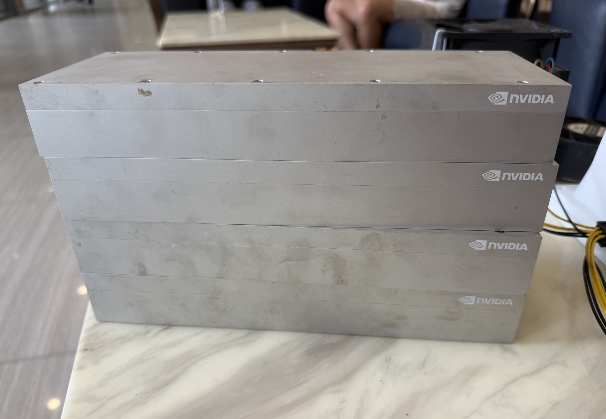

# Club CMP 170HX

Community-tested recipes, diagnostics, and reproducible benchmarks for running AI workloads on NVIDIA CMP 170HX cards.

This project is building a practical, low-cost SM80 compute pool for:

- large-language-model inference;
- image generation;
- video generation;
- CUDA validation and memory-heavy research workloads;
- single-node and distributed experiments.

The CMP 170HX shares useful traits with A100-class hardware, including SM80 compute capability and high-capacity HBM. It is **not an A100 replacement**: it has an unsupported software path, no display output, no NVLink, limited PCIe behavior in common passthrough setups, and unusual cooling and power requirements.

## Start here

| Goal | Guide |
|---|---|
| Understand the card and trade-offs | [Hardware](docs/HARDWARE.md) |
| Install it in a Proxmox VM | [Installation](docs/INSTALLATION.md) |
| Validate a new or used card | [QC and acceptance testing](docs/QC.md) |
| Control heat and noise | [Cooling and power](docs/COOLING-AND-POWER.md) |
| Plan a multi-card node | [Cluster design](docs/CLUSTER.md) |
| Diagnose failures | [Troubleshooting](docs/TROUBLESHOOTING.md) |
| Compare measured results | [Benchmarks](docs/BENCHMARKS.md) |
| Avoid past operator mistakes | [Operator lessons](docs/OPERATOR-LESSONS.md) |
| What the world knows about this card | [Unlock and mod research](docs/RESEARCH-CMP170HX-UNLOCKS.md) |
| Choose an AI workload | [Workload matrix](docs/WORKLOADS.md) |
| Read the consolidated lessons | [What we learned](docs/LESSONS.md) |
| See every model tried on this card | [Model status](docs/MODEL-STATUS.md) |
| Read an executed experiment notebook | [Notebooks](notebooks/README.md) |

## Notebooks

Each row links one executed Jupyter notebook, top to bottom, with committed
outputs. The schema and the LIVE-replay convention are in
[notebooks/README.md](notebooks/README.md).

| Date | Experiment | Headline | Notebook |
|---|---|---|---|
| 2026-09-02 | DeepSeek-V4-Flash-Vision-Exp, 4x CMP 170HX, PP4 + DSpark k=6 | 220.2 tok/s aggregate decode at c=8 (median of 3); c=16 fails with a device-side assert | [notebooks/2026-09-02-deepseek-v4-flash-vision-exp-4card-pp4-vllm.ipynb](notebooks/2026-09-02-deepseek-v4-flash-vision-exp-4card-pp4-vllm.ipynb) |
| 2026-09-02 | DeepSeek-V4-Flash-Vision-Exp, vision on 4x CMP 170HX, PP4 + DSpark k=6 (in progress) | Vision gates not run on this recipe yet; reference-runtime vision PASS on a different topology is shown as prior evidence | [notebooks/2026-09-02-deepseek-v4-flash-vision-exp-4card-vision-pp4-vllm.ipynb](notebooks/2026-09-02-deepseek-v4-flash-vision-exp-4card-vision-pp4-vllm.ipynb) |

## Four-card rig update



I traded out three RTX 3090s and rebuilt this node around four CMP 170HXs. The reason was simple: the four cards expose 256 GiB of aggregate HBM in one box. The lab still has RTX 3090 cards and DGX Spark systems, giving us useful comparison points for consumer CUDA, low-cost SM80/HBM, and GB10. DGX Spark notes live in [club-dgx-spark](https://github.com/PixelML/club-dgx-spark).

**Measured on 2026-08-30:** all four cards enumerated in one Ubuntu guest with driver 610.43.03 and reported 65,536 MiB each. Under the current build (four cards in an open frame with one 80 mm blower on a printed duct), an idle snapshot the same day showed 37–38 °C cores, 41–51 °C memory temperatures, and about 141 W for the group at zero utilization. Cooling and power details are in [Cooling and power](docs/COOLING-AND-POWER.md).

### Four-card results: DeepSeek-V4-Flash-Vision-Exp

The four cards now serve `deepseek-ai/DeepSeek-V4-Flash-Vision-Exp` (FP8, 48 shards, revision `86f746b3`). Two runtimes ran on the same checkpoint. Each runtime answers a different question.

1. **Text path, performance.** The SM80 vLLM fork with pipeline parallel 4 (layer partition `11,11,11,10`) and DSpark speculative decoding at `k=6`. A normalized benchmark is in progress. Placeholders below are filled from that run; the earlier ladder numbers (101.21 tok/s at c=1, 169.65 tok/s at c=4) came from an earlier run with unverified provenance and are superseded.
2. **Vision path, correctness.** The reference TP4 runtime with SM80 fallback patches completed the first real-image inference of this checkpoint on Ampere hardware. It decodes at about 0.9 tok/s and is a correctness result, not a performance result.

| Measurement | Value | Status |
|---|---:|---|
| Decode, c=1 (text path, PP4, DSpark k=6) | 97.4 tok/s (median of 3; 57.6–123.5) | Measured 2026-09-02 |
| Aggregate, c=4 | 165.5 tok/s (median of 3; 140.3–203.2) | Measured 2026-09-02 |
| Aggregate, c=16 | failed (device-side assert, reproduced twice) | Measured 2026-09-02 |
| Uncached prefill, 2,941 input tokens | 2,352 tok/s warm (362 tok/s first cold prefill) | Measured 2026-09-02 |
| Warm TTFT | 0.394 s | Measured 2026-09-02 |
| Real-image completion (vision path, TP4 reference runtime) | PASS, 0.9 tok/s decode | Correctness evidence only |

The upstream Vision vLLM path needed four SM80 patches before the engine reached readiness. Three are fixed with fallbacks; one is structural and unresolved. The gap table, the vision milestone, and the negative results are in [Benchmarks](docs/BENCHMARKS.md#deepseek-v4-flash-vision-exp-four-cards). The SM80 vLLM fork and patch set build on the work of [allover326](https://github.com/allover326/vllm-dsa-mtp-sm80).

**Cross-platform context.** The same checkpoint at the same revision also runs on a two-node DGX Spark kit (GB10, vLLM, TP=2): c=1 36.9 tok/s, c=6 112.7 tok/s aggregate, uncached prefill 1,789 tok/s, vision PASS (merged evidence; a normalized 2,941/400-token rerun at c=1 48.7 is in an open PR there). Results: [DeepSeek-V4-Flash-Vision-Exp-DGX-Spark](https://github.com/PixelML/DeepSeek-V4-Flash-Vision-Exp-DGX-Spark). The two platforms use different runtimes, parallelism, and memory budgets. Read the numbers as context, not as a head-to-head comparison.

## Verified baseline

The current hardware and repeatable software baseline is:

- 4 × CMP 170HX installed, each reporting 64 GiB VRAM;
- published load tests on one-, three-, and four-card topologies;
- Ubuntu 22.04 guest on a Proxmox Q35 VM with SeaBIOS;
- Linux 6.8 and NVIDIA 610.43.03 open kernel modules;
- pinned `cmpunlocker` v0.1 patch set;
- 125 W quiet/idle policy and 180 W benchmark policy;
- forced airflow across every passive heatsink.

Exact versions matter. Treat this as a known-good reference, not a claim that every card, board, BIOS, kernel, or driver combination will work.

## Published workload results

Canonical scoreboard of PixelML measurements on CMP 170HX. The status column
separates publication-safe results from provisional or blocked measurements.
Normalized metrics, methodology, and evidence tiers:
[docs/BENCHMARKS.md](docs/BENCHMARKS.md). Raw manifests and receipts stay in
the model repositories; small redacted snapshots may be retained here when the
detailed ledger is not public.

| Workload | Quant / runtime | Topology | Decode | Aggregate | Quality / success | Status | Evidence |
|---|---|---|---|---|---|---|---|
| GLM-5.3-Flash | UD-IQ4_XS · llama.cpp | 4 cards · layer split · 16k ctx · c ≤ 4 | 17.73 tok/s median @ c=1 | ~17.5–17.7 tok/s @ c=2/4 | 21/26 local tasks · 41/41 soak | Publication-safe | [Result card](results/2026-08-30-glm-5.3-flash-ud-iq4xs-llamacpp-cmp170hx.md) · [Evidence pin](https://github.com/PixelML/GLM-5.3-Flash-CMP-170HX/blob/7fc71e00925f7b7902764aab7d08b6d923aaaea4/results/phase63/run-manifest.json) |
| GLM-5.3-Flash | NVFP4 | 3 cards | — | — | — | Not compatible: SM121-format weights on SM80; AWQ INT4 ≈ 66 GiB/card does not fit 3 × 64 GiB | [Negative result](docs/BENCHMARKS.md#negative-results-matter) |
| Qwen3.8-27B | NVFP4 · vLLM | 1 card × 3 runs @ 180 W | — | — | — | Pending evidence repair: [repo PR 1](https://github.com/PixelML/Qwen3.8-27B-CMP-170HX/pull/1) | [Repo](https://github.com/PixelML/Qwen3.8-27B-CMP-170HX) |
| DeepSeek-V4-Flash-0731 | FP8 · vLLM pipeline | 3 cards | — | — | — | Pending evidence repair: [repo PR 1](https://github.com/PixelML/DeepSeek-V4-Flash-0731-CMP-170HX/pull/1) | [Repo](https://github.com/PixelML/DeepSeek-V4-Flash-0731-CMP-170HX) |
| DeepSeek-V4-Flash-Vision-Exp | FP8 · SM80 vLLM fork | 4 cards · PP4 · DSpark k=6 | 97.4 tok/s (median of 3; 57.6–123.5) @ c=1 | 165.5 tok/s (median of 3; 140.3–203.2) @ c=4 · failed (device-side assert, reproduced twice) @ c=16 · 2,352 tok/s warm (362 tok/s first cold prefill) prefill | Text passed; image not served on this path | Benchmark in progress; supersedes the earlier ladder | [Repo](https://github.com/PixelML/DeepSeek-V4-Flash-Vision-Exp-CMP-170HX) · [Benchmarks](docs/BENCHMARKS.md#deepseek-v4-flash-vision-exp-four-cards) |
| DeepSeek-V4-Flash-Vision-Exp | FP8 · SM80 vLLM fork | 4 cards · PP4 · DSpark k=6 | 59.78 tok/s warm (single stream) | 101.21 tok/s @ c=1 · 169.65 tok/s @ c=4 · 325.5 tok/s prefill | Text passed; image rejected (HTTP 400) | Earlier run, provenance unverified, superseded | [Result summary](results/2026-08-31-deepseek-v4-flash-vision-exp-cmp170hx.md) |
| DeepSeek-V4-Flash-Vision-Exp | FP8 → BF16 fallback · reference TP4 runtime + SM80 patches | 4 cards · TP4 · batch 1 | 0.9 tok/s | — | Real-image completion PASS; prefill OOM above ~1,024 tokens | Correctness evidence only, not a performance result | [Repo](https://github.com/PixelML/DeepSeek-V4-Flash-Vision-Exp-CMP-170HX) · [Benchmarks](docs/BENCHMARKS.md#vision-correctness-milestone) |

`—` = not presented without sanitized stable evidence. Pending and provisional
rows are not decision-grade; they remain visible so measured learning is not
lost, but their status and blockers must stay explicit.

The three Vision-Exp rows describe one checkpoint on two runtimes. The first
row is the in-progress normalized text benchmark. The second row keeps the
earlier ladder visible; the numbers are measured, but the runtime source
revision was unavailable from the running image and the protocol differed from
the single-stream baseline, so the row is superseded. The third row is the
vision-correctness milestone; its decode rate is not a performance claim.

## Hugging Face

Curated, verified artifacts from this club: [PixelML/club-170hx: verified on CMP 170HX (SM80)](https://huggingface.co/collections/PixelML/club-170hx-verified-on-cmp-170hx-sm80-6a97bf4edc20b52c5cf454e3).

## Repository map

```text
docs/       Hardware, setup, QC, operations, troubleshooting, and results
scripts/    Read-only inventory, model-fit, and card-validation helpers
workloads/  LLM, image, and video workload recipes and status
results/    Submission format for reproducible community results
```

## Safety first

CMP 170HX cards use passive server heatsinks. Do not run sustained workloads without directed, monitored airflow. Our default stop thresholds are 80 °C core or 85 °C memory. A cold power cycle may be required after a card falls off the PCIe bus.

The unlock path is community-maintained and unsupported by NVIDIA. Back up the machine, pin known-good artifacts, verify module provenance, and expect recovery work.

## Contributing

Please read [CONTRIBUTING.md](CONTRIBUTING.md). Benchmark claims need raw, redacted evidence and full environment metadata. Security and privacy rules are in [AGENTS.md](AGENTS.md) and [SECURITY.md](SECURITY.md).

Inspired by the community-first documentation style of [club-3090](https://github.com/noonghunna/club-3090).

## License

Apache-2.0. See [LICENSE](LICENSE).
