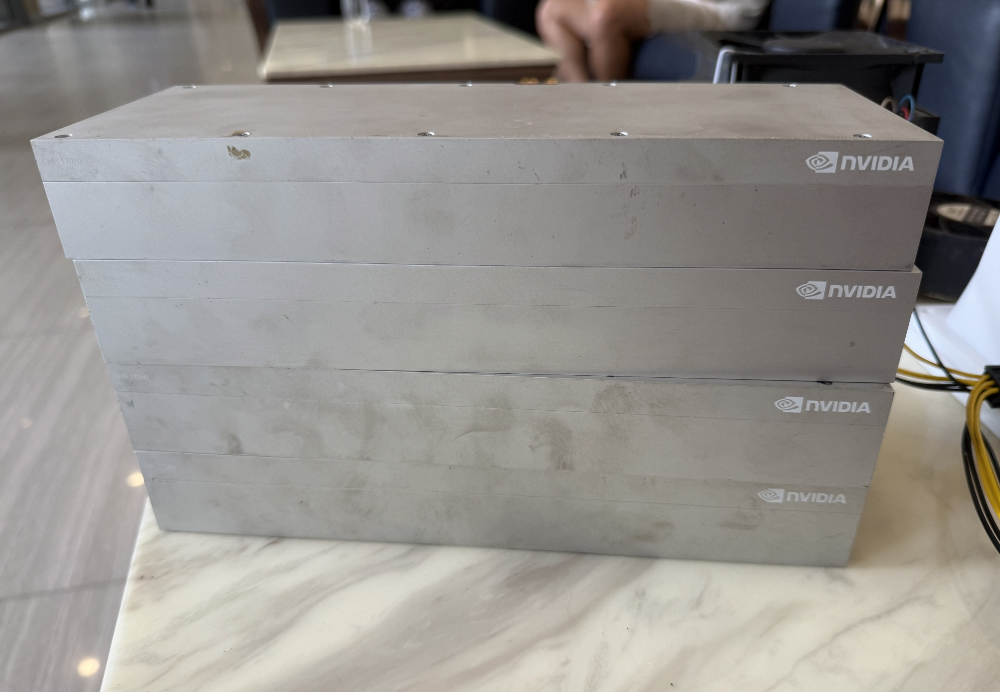

# Club CMP 170HX

Community-tested recipes, diagnostics, and reproducible benchmarks for running AI workloads on NVIDIA CMP 170HX cards.

This project is building a practical, low-cost SM80 compute pool for:

- large-language-model inference;
- image generation;
- video generation;
- CUDA validation and memory-heavy research workloads;
- single-node and distributed experiments.

The CMP 170HX shares useful traits with A100-class hardware, including SM80 compute capability and high-capacity HBM. It is **not an A100 replacement**: it has an unsupported software path, no display output, no NVLink, limited PCIe behavior in common passthrough setups, and unusual cooling and power requirements.

## Credits

This club stands on other people's work. The authors:

- **Amogh Munikote** ([@amoghmunikote](https://github.com/amoghmunikote)) authored [cmpunlocker](https://github.com/amoghmunikote/cmpunlocker), the unlock that gives these cards 64 GB, 74 SMs and Gen2 x16, and 170th Street.
- **admunch888** ([@admunch888](https://github.com/admunch888)) authored the four BAR1 peer-to-peer patches in [admunch888/cmpunlocker](https://github.com/admunch888/cmpunlocker), ported from work by bayley.
- **Cachenetics** ([@cachenetics](https://github.com/cachenetics)) authored 170tune (HBM clock control).
- **Morrowmake** ([@Morrowmake](https://github.com/Morrowmake)) authored the CMP 170HX GLM-5.3-Flash recipes (1.6.0, v1.7.0) and the vLLM image we benchmark.
- **allover326** ([@allover326](https://github.com/allover326)) authored the SM80 vLLM DSA/MTP fork and patches ([vllm-dsa-mtp-sm80](https://github.com/allover326/vllm-dsa-mtp-sm80)) under our sm80vllm work.
- **promisezackr** ([@promisezackr](https://github.com/promisezackr)) authored the PP8 patch set and KV-balancing partition, building on kevin ([@344303947](https://github.com/344303947)) and bayley.
- **lazymio** ([@wtdcode](https://github.com/wtdcode)) authored the GLM-5.3-Flash AWQ W4A16 checkpoint and its SM80 vLLM enablement.
- **syv.ai** ([@syv-ai](https://github.com/syv-ai)) authored the Qwen3.8-27B recipe and W4A16 DFlash2 draft; **David Birks** ([@dbirks](https://github.com/dbirks)) the Qwen3.8-27B W4A16 AutoRound.
- **Inco AI** ([@incoai](https://github.com/incoai)) authored the GLM-5.3-Flash DFlash2 drafter (CC BY-NC-ND 4.0, internal use).
- **Naoki Kishida** ([@kishida](https://github.com/kishida)) authored the llama.cpp `jev` branch and LLKVApprox.
- **Ithrial** ([@Ithrial](https://github.com/Ithrial)) authored the Ninfer sm_80 fork; **Turboderp** ([@turboderp-org](https://github.com/turboderp-org)) ExLlamaV3; **The Royal Lab** ([@theroyallab](https://github.com/theroyallab)) TabbyAPI; **PrismML** ([@PrismML-Eng](https://github.com/PrismML-Eng)) the PQ2_0 llama.cpp fork; **Mia's AI Lab** ([@MiaAI-Lab](https://github.com/MiaAI-Lab)) the bench protocol and EXL3 checkpoints; **Ash** ([@ashhart](https://github.com/ashhart)) TensorFold.
- **L-Forster** ([@L-Forster](https://github.com/L-Forster)) authored the [open-jet megakernel](https://github.com/L-Forster/open-jet/tree/93c2b9abee50ea2ea41981c406cfd201989e4d58/megakernel) (Qwen3.8-27B, AGPL-3.0), the design our Qwen3.8-Flash-Next decode kernel follows; **ggml-org** ([@ggml-org](https://github.com/ggml-org)) authored [llama.cpp](https://github.com/ggml-org/llama.cpp) and its `qwen4exp` reference; **Unsloth** ([@unslothai](https://github.com/unslothai)) authored the [Qwen3.8-Flash-Next GGUF](https://huggingface.co/unsloth/Qwen3.8-Flash-Next-GGUF) quants.
- Video: **MiniMax** ([@MiniMax-AI](https://github.com/MiniMax-AI)) authored [MiniMax H3](https://github.com/MiniMax-AI/MiniMax-H3); **Comfy-Org** ([Comfy-Org/MiniMax-H3](https://huggingface.co/Comfy-Org/MiniMax-H3)) the pruned int8 ConvRot files; **Larryvrh** ([@larryvrh](https://github.com/Larryvrh)) the [H3 Turbo LoRA and sampler](https://github.com/Larryvrh/ComfyUI-MiniMax-H3-Turbo); **comfyanonymous** ([@comfyanonymous](https://github.com/comfyanonymous)) and Comfy Org [ComfyUI](https://github.com/comfyanonymous/ComfyUI); the **SGLang team** ([@sgl-project](https://github.com/sgl-project)) SGLang Diffusion; **apolinario** ([@apolinario](https://github.com/apolinario)) the diffusers H3 integration; **thu-ml** ([@thu-ml](https://github.com/thu-ml)) SageAttention; **SYSTRAN** ([@SYSTRAN](https://github.com/SYSTRAN)) faster-whisper. Benchmark prompts P1–P3 were authored by **cocktail peanut** ([@cocktailpeanut](https://x.com/cocktailpeanut)), **Noor** ([@noorlewisx](https://x.com/noorlewisx)) and **Zara** ([@ZaraIrahh](https://x.com/ZaraIrahh)).
- Models: GLM by zai-org, DeepSeek by deepseek-ai, Qwen by Qwen, MiMo by the Xiaomi MiMo team. Hardware research: niconiconi, Xing Kangwei, thaurock-x, @kha84, @snapo, PhillThomas (see [the unlock research](docs/RESEARCH-CMP170HX-UNLOCKS.md)).
- Documentation style follows [club-3090](https://github.com/noonghunna/club-3090), authored by noonghunna ([@noonghunna](https://github.com/noonghunna)).

Each notebook and result pins the exact commit or revision it used.

## Start here

| Goal | Guide |
|---|---|
| **Everything we know about the card, in one page** | [CMP 170HX understanding](docs/CMP170HX-UNDERSTANDING.md) |
| Understand the card and trade-offs | [Hardware](docs/HARDWARE.md) |
| Install it in a Proxmox VM | [Installation](docs/INSTALLATION.md) |
| Validate a new or used card | [QC and acceptance testing](docs/QC.md) |
| Control heat and noise | [Cooling and power](docs/COOLING-AND-POWER.md) |
| Plan a multi-card node | [Cluster design](docs/CLUSTER.md) |
| Understand the PCIe link and choose PP vs TP | [Topology and parallelism](docs/TOPOLOGY-AND-PARALLELISM.md) |
| Diagnose failures | [Troubleshooting](docs/TROUBLESHOOTING.md) |
| Compare measured results | [Benchmarks](docs/BENCHMARKS.md) |
| Avoid past operator mistakes | [Operator lessons](docs/OPERATOR-LESSONS.md) |
| What the world knows about this card | [Unlock and mod research](docs/RESEARCH-CMP170HX-UNLOCKS.md) |
| Reproduce a measured result | [Runnable notebooks](recipes/README.md) |
| Choose an AI workload | [Workload matrix](docs/WORKLOADS.md) |
| Read the consolidated lessons | [What we learned](docs/LESSONS.md) |
| See every model tried on this card | [Model status](docs/MODEL-STATUS.md) |
| Run a specific model: quick start, settings, troubleshooting | [Model guides](docs/models/README.md) |
| Read an executed experiment notebook | [Notebooks](notebooks/README.md) |

## Notebooks

Each row links one executed Jupyter notebook, top to bottom, with committed
outputs. The schema and the LIVE-replay convention are in
[notebooks/README.md](notebooks/README.md).

| Date | Experiment | Headline | Notebook | Video |
|---|---|---|---|---|
| 2026-10-06 | MiniMax H3 video + audio generation on 1x CMP 170HX: nine short-drama shot types, four sampler configs, four engines (ComfyUI, ComfyUI + SageAttention, SGLang Diffusion, diffusers), power cap 140/200/250 W, vs one DGX Spark | **A 5.2 s dialogue close-up with native voice takes 85 s on one card (ComfyUI, pruned int8 ConvRot + Turbo LoRA 4-step, 140 W), word-exact in 52 of 57 single-speaker runs.** The card is power-bound at 140 W: 200 W is 22–30% faster per shot at the same energy; 250 W is 29–38% faster for one clip but a warm card passes 83 °C core in 10–45 s. Step cost grows faster than clip length (10 s = 2.8x a 5 s shot). One DGX Spark is 1.7x slower. SGLang (same int8 files) 2x and diffusers 2.5x slower per step; SageAttention ±3% | [notebooks/2026-10-06-minimax-h3-video-1card-comfyui.ipynb](notebooks/2026-10-06-minimax-h3-video-1card-comfyui.ipynb) | [mp4](assets/video/minimax-h3-cmp170hx/p1-kowloon-onetake-turbo4-576x1024.mp4) |
| 2026-10-10 | Qwen3.8-Flash-Next (177B A3B MoE, unsloth UD-Q3_K_XL GGUF) on 1x CMP 170HX: a new single-kernel decode engine following L-Forster's open-jet megakernel design, vs llama.cpp on the same GGUF | **70.6 tok/s vs 53.4 tok/s for llama.cpp (1.32x), batch 1, greedy, 512 tokens; 1,870 / 1,890 teacher-forced positions agree, every miss a near-tie in llama.cpp itself.** The 26.8 GiB PLE n-gram table stays in host RAM and must sit on a local disk (network mount: 29 tok/s). One step reads ~5.8 GB in 14 ms (~27% of HBM peak) across 486 grid barriers. vLLM cannot fit this model on one card (inferred). Batch 1, ≤2k context, no MTP, no server yet. Peak 77 °C (llama.cpp run: 82 °C, uncapped 250 W) | [notebooks/2026-10-10-qwen3.8-flash-next-megakernel-1card.ipynb](notebooks/2026-10-10-qwen3.8-flash-next-megakernel-1card.ipynb) | — |
| 2026-10-02 | GLM-5.3-Flash W4A16 + DFlash2 TP4 on 4x CMP 170HX behind two PLX switches: 70 → 74 SMs, HBM clock equalised across cards, power-cap sweep 165–100 W; plus a copy-drafts A/B on the PixelML/sm80vllm fork | **Two cards shipped a VBIOS running HBM at 1,458 MHz vs 1,728 on the other two; equalising them (hot-gated, 0 errors) gives 418.0 / 309.9 / 214.1 tok/s single-user and 816.5 at eight users (+6% / +3%), the best on this host.** +4 SMs: no clear decode gain. Power: 140 W keeps ~99% of 150 W throughput for 8% less GPU power (new default); 110 W is the tokens-per-watt peak (1.62 vs 1.40); 165 W adds ≤1.1% and runs HBM at 82–83 °C. Copy drafts: +37% on an edit reply that repeats the prompt, −0.3 to −2.2% elsewhere. SM VF offset +200: within noise, and impossible on the 250 W VBIOS cards (NVML range [0..0], the gate still passes) | [notebooks/2026-10-02-glm-5.3-flash-4card-tp4-sm74-hbm-power-vllm.ipynb](notebooks/2026-10-02-glm-5.3-flash-4card-tp4-sm74-hbm-power-vllm.ipynb) | — |
| 2026-10-01 | GLM-5.3-Flash W4A16 + DFlash2, Morrowmake recipe 1.6.0, TP4 on 4x CMP 170HX at Gen2 x16 behind two PLX switches (Broadwell host), P2P on vs off | **Matches Morrowmake's EPYC TP4 P2P-off numbers on a PLX + Broadwell host: 396.0 tok/s structured single-user (theirs 394.0), 798.6 at eight users (797.9), cold prefill 2,701 tok/s (2,669), same 1,072,150-token KV pool.** BAR1 P2P makes TP4 decode 20–26% slower for one user and 38–48% for eight here (steps 26.1 vs 19.4 ms), the opposite of Morrowmake's EPYC result; best variant P2P off + replicated embedding 398.4 / 812.0. Single-user code is 19% under theirs (open). Apache-2.0 DFlash2-G drafter does not load on this engine | [notebooks/2026-10-01-glm-5.3-flash-morrowmake-1.6.0-4card-tp4-vllm.ipynb](notebooks/2026-10-01-glm-5.3-flash-morrowmake-1.6.0-4card-tp4-vllm.ipynb) | — |
| 2026-10-01 | Static-BAR1 P2P on 4x CMP 170HX at Gen2 x16 behind two PLX switches (Broadwell host): upstream unlock + serialized BAR1 resize + 4 BAR1-P2P patches + a hand-programmed PCIe layout adopted via kexec | **Direct P2P on all 12 ordered pairs, every byte verified, 5.79 GB/s each; copy latency 16 vs 22 µs at 4 KiB and 194 vs 343 µs at 1 MiB (up to 1.77× faster than host-staged), large copies 8% slower.** Qwen3.8-27B W4A16 TP2 single-user decode +11% (80.0 vs 71.8 tok/s), +14% with MTP k=3 (110.8 vs 97.6); GLM-5.3-Flash TP4 decode −26% to −44% with P2P (293 vs 396 tok/s structured, 1 user) — leave P2P off for TP4 on PLX + Broadwell ([GLM TP4 notebook](notebooks/2026-10-01-glm-5.3-flash-morrowmake-1.6.0-4card-tp4-vllm.ipynb)). The BIOS leaves no room for two 64 GiB BAR1s behind one switch; placing each BAR3 below its BAR1 fixes it. Same-switch = cross-switch | [notebooks/2026-10-01-cmp170hx-4card-bar1-p2p-plx-cuda.ipynb](notebooks/2026-10-01-cmp170hx-4card-bar1-p2p-plx-cuda.ipynb) | — |
| 2026-10-01 | GPU-to-GPU copies and NCCL all-reduce, 3x CMP 170HX at Gen2 x16 behind two PLX switches, no P2P patches | **No direct P2P (canAccessPeer 0 on all pairs); host-staged copies still hit 6.2–6.3 GB/s at 256 MiB, ~94% of the 6.68 GB/s single-card link, and cost 22 µs at 4 KiB.** Same-switch and cross-switch pairs measure the same. NCCL uses SHM: 2-GPU all-reduce 3.7–3.8 GB/s busbw, 120–145 µs at 8 KiB. Also ships a driver patch that serializes the unlock's 64 GB BAR1 resize — without it, cards sharing a PLX switch corrupted the kernel on every boot | [notebooks/2026-10-01-cmp170hx-3card-p2p-plx-cuda.ipynb](notebooks/2026-10-01-cmp170hx-3card-p2p-plx-cuda.ipynb) | — |
| 2026-10-01 | Qwen3.8-27B W4A16 (stock AutoRound), vLLM sm80, TP1 vs TP2 on two PLX switches without P2P, + native MTP k=3 | **TP2 lifts single-stream decode 54.0 → 72.0 tok/s (+33%) even with NCCL over host memory; TP2 + MTP k=3 reaches 103.5 tok/s.** Under load the gain vanishes (c=16: 530–535 tok/s TP2 vs 546 TP1) and prefill is 9–11% slower (1,695–1,736 vs 1,914 tok/s at 6.6k). Same-switch vs cross-switch: identical. MTP only pays at c=1. 180 W, peak 74 °C | [notebooks/2026-10-01-qwen3.8-27b-w4a16-2card-tp2-vllm.ipynb](notebooks/2026-10-01-qwen3.8-27b-w4a16-2card-tp2-vllm.ipynb) | — |
| 2026-10-01 | MiMo-V2.6-Flash-RL, 3x CMP 170HX, PP3 and PP3 + MTP k=2, re-run at Gen2 x16 behind PLX switches (bare metal, no P2P) | **No gain from the faster link: 113.8 tok/s greedy c=1 with MTP k=2 (prior Gen1 x16 run 117.7), 74.6 plain PP3 (75.5); 518 tok/s at c=32 (561).** PP decode is HBM-bound. Gates 4/4, uncached prefill 4,107 tok/s at 20.3k, MTP acceptance 2.2 | [notebooks/2026-10-01-mimo-v2.6-flash-3card-pp3-vllm.ipynb](notebooks/2026-10-01-mimo-v2.6-flash-3card-pp3-vllm.ipynb) | — |
| 2026-09-20 | Qwen3.8-27B W4A16 GPTQ as a **no-train Jev-compatible endpoint** (`/v1/systemone`), 1x CMP 170HX, vLLM sm80 | **Classification works on this card and survived its first production workload; the calibration is the project. No-train method: stock W4A16 checkpoint served read-only, and the only fitted quantity (a temperature) failed leave-one-out. Production (2026-09-21): an LLM-as-judge annotation pilot, 19,045 annotations in 4.5 h, 0 failures, 5 permutation reads/annotation, 1,952 tok/s prefill at a 178 W mean, answer 141.7 ms idle vs 12.0 s mean at 16 clients (99.8% within 15 s, queue-bound), prefix-cache hit 0.0%.** No-token reads return exact per-option probabilities: p50 141.7 ms warm / 133.0 ms cache-busted at c=1, bit-identical on repeat and across two concurrent requests, and `softmax(logits/T)` exact to 8e-17. Three findings a vLLM host must know: vLLM's default `logprobs_mode` computes logprobs *before* `allowed_token_ids` so label reads return nothing usable (`--logprobs-mode processed_logprobs` required); the checkpoint's `generation_config` (`top_k=20, top_p=0.95`) silently drops low-mass labels unless the read neutralises it; option order shifts probabilities by up to 0.639 L1 and flips argmax (Jev's `permutations` averages it). Honest reading on 42 author-labelled reads: accuracy 0.571 (95% CI 0.42-0.71), ECE 0.274 at T=1; fitting T=2.16 improves ECE in-sample (0.223) but leave-one-out fitting is *worse* than T=1 (0.301), so n=42 cannot certify a temperature — a demonstration of Jev's fitting loop, not a calibrated endpoint. | [notebooks/2026-09-20-qwen3.8-27b-w4a16-jev-1card-vllm.ipynb](notebooks/2026-09-20-qwen3.8-27b-w4a16-jev-1card-vllm.ipynb) | — |
| 2026-09-19 | Bonsai-2 27B (ternary → W4A16 conversion) + DFlash2 k=7, vLLM 0.28, 1x CMP 170HX | **Mechanism parity, and a bit more.** 155.7 tok/s c=1 decode (256-token cohort, ttft-excl.) / 251.6 tok/s (900-token cohort, adaptive draft depth) vs the 147.7 Qwen3.8-27B receipt on the same card class; prefill 1876 tok/s at 6.6k; acceptance 4.17 tokens/draft from the ZERO-SHOT base-calibrated drafter. The conversion out of the Hadamard-folded GGUF (v-reorder + unrotation + delta-norms + MTP graft) is documented, reproducible, and published at [PixelML/Bonsai-2-27B-W4A16](https://huggingface.co/PixelML/Bonsai-2-27B-W4A16); the W4A16 checkpoint is 18.6 GB vs the ternary lane's 6.7 GB at 54.5 tok/s — the two lanes are complements (footprint vs throughput). 68/78 °C peaks, 101 W mean | [notebooks/2026-09-19-bonsai-2-27b-w4a16-dflash2-1card-vllm.ipynb](notebooks/2026-09-19-bonsai-2-27b-w4a16-dflash2-1card-vllm.ipynb) | — |
| 2026-09-18 | Bonsai 2 27B (ternary g128, PrismML llama.cpp fork b10685), 1x CMP 170HX, PQ2_0 vs PTQ1_0 | **Recipe of record: PQ2_0.** 54.5 tok/s c=1 decode (llama-bench tg128) and 52.6 tok/s served (usage-counted, median of 3) at a 180 W cap — 2.54 J/tok, better than the community-reported H100 figure for this model; 873 tok/s pp512, 816 tok/s served prefill on a 6.6k prompt; decode holds 51.5→46.8 tok/s from 1k to 32k filled context. Measured surprises: the packing ranking flips between surfaces (PTQ1_0 benches 25-33% behind but *serves* at parity — reproducible, cause unidentified) and the fork clamps the model to `n_slots = 1` despite `-np 8`, so "aggregate" stays at the single-stream rate and concurrency is queueing. No speculative decoding exists for Bonsai 2 (no DSpark drafter published). Peak 73 °C core / 77 °C memory, no thermal stop approached | [notebooks/2026-09-18-bonsai-2-27b-ternary-1card-llamacpp.ipynb](notebooks/2026-09-18-bonsai-2-27b-ternary-1card-llamacpp.ipynb) | — |
| 2026-09-05 | GLM-5.3-Flash, 4x CMP 170HX, PP4 + native MTP k=3, AWQ W4A16, vLLM sm80 | **Recipe of record.** 87.6 tok/s c=1 decode (temp 0, median of 3, clean) / 67.9 tok/s (temp 0.7 + `ignore_eos`, median of 5); decode flat at 75-79 tok/s from 2k to 131k prompt tokens; 78.4 tok/s best aggregate at c=16 and 1,752 tok/s prefill at 16k, both measured on a degraded PCIe link. GSM8K 49/50, HumanEval 19/20 pass@1, structured output 10/10; 3/3 stability rounds at c=8 with zero Xid; boots 8/8; MTP k=3 is 1.62x the measured speculation-off baseline; no lossless verdict available because greedy is not reproducible on this stack with speculation on or off. Supersedes the TP4 lane: PP is 4.2x more link-tolerant on this fabric | [notebooks/2026-09-05-glm-5.3-flash-4card-pp4-vllm.ipynb](notebooks/2026-09-05-glm-5.3-flash-4card-pp4-vllm.ipynb) | [mp4](assets/video/glm53-pp4-motion/glm53-pp4-motion-1080x1920.mp4) |
| 2026-09-02 | Four-card tensor-core correctness gate, post-incident recovery verification | 4/4 cards PASS, 74.6–78.5 TFLOP/s, 0 Xid; recovery check after a fleet-wide OOM led to a UVM fatal error and a VM reboot | [notebooks/2026-09-02-cmp170hx-health-gate.ipynb](notebooks/2026-09-02-cmp170hx-health-gate.ipynb) | — |
| 2026-09-02 | DeepSeek-V4-Flash-Vision-Exp, 4x CMP 170HX, PP4 + DSpark k=6 | 220.2 tok/s aggregate decode at c=8 (median of 3); c=16 fails with a device-side assert | [notebooks/2026-09-02-deepseek-v4-flash-vision-exp-4card-pp4-vllm.ipynb](notebooks/2026-09-02-deepseek-v4-flash-vision-exp-4card-pp4-vllm.ipynb) | [mp4](assets/video/dsv4-vision-4card-motion/dsv4-vision-4card-motion-1080x1920.mp4) |
| 2026-09-02 | DeepSeek-V4-Flash-Vision-Exp, vision on 4x CMP 170HX, PP4 + DSpark k=6 | Vision gates PASS, 10/10 image keyword match; text-only decode 119 tok/s median of 5 reps (peak 162) @ c=1, server crashed at c=4 | [notebooks/2026-09-02-deepseek-v4-flash-vision-exp-4card-vision-pp4-vllm.ipynb](notebooks/2026-09-02-deepseek-v4-flash-vision-exp-4card-vision-pp4-vllm.ipynb) | [mp4](assets/video/dsv4-vision-4card-vision-motion/dsv4-vision-4card-vision-motion-1080x1920.mp4) |
| 2026-09-02 | DeepSeek-V4-Flash-Vision-Exp highlight reel: text ladder, vision gates, 5 SM80 fixes, cross-platform tok/Wh | 10/10 image keyword match; C1 97-119, C8 220 tok/s aggregate; CMP 170HX 2.4x cheaper per token than 2x DGX Spark at c=8 | [notebooks/2026-09-02-deepseek-v4-flash-vision-exp-4card-vision-pp4-vllm.ipynb](notebooks/2026-09-02-deepseek-v4-flash-vision-exp-4card-vision-pp4-vllm.ipynb) | [mp4](assets/video/club-170hx-highlights-2026-09-02/club-170hx-highlights-2026-09-02-1080x1920.mp4) |
| 2026-09-02 | DeepSeek-V4-Flash-Vision-Exp, chart-led 20s cut: tok/s vs concurrency, tok/Wh, 4x CMP 170HX vs 2x DGX Spark | 119 tok/s median at c=1 (peak 162); c=4+ crashes on the vision build; CMP 2.4x cheaper per token, Spark 2x more efficient | [notebooks/2026-09-02-deepseek-v4-flash-vision-exp-4card-pp4-vllm.ipynb](notebooks/2026-09-02-deepseek-v4-flash-vision-exp-4card-pp4-vllm.ipynb) | [mp4](assets/video/dsv4-vision-4card-chart-20s/dsv4-vision-4card-chart-20s-1080x1920.mp4) |
| 2026-08-30 | DeepSeek-V4-Flash-0731, 3x CMP 170HX, PP3 vLLM | 83.3 tok/s aggregate decode, DSpark k=5, 180 W/card | [notebooks/2026-08-30-deepseek-v4-flash-0731-3card-pp3-vllm.ipynb](notebooks/2026-08-30-deepseek-v4-flash-0731-3card-pp3-vllm.ipynb) | — |
| 2026-08-30 | Qwen3.8-27B W4A16 AutoRound + DFlash2, 1x CMP 170HX vLLM | Best local 140.3 tok/s decode at 180 W (95% of a 255 W rented card's decode at 71% of the power cap) | [notebooks/2026-08-30-qwen3.8-27b-w4a16-dflash2-1card-vllm.ipynb](notebooks/2026-08-30-qwen3.8-27b-w4a16-dflash2-1card-vllm.ipynb) | [mp4](assets/video/qwen38-27b-motion/qwen38-27b-motion-1080x1920.mp4) |
| 2026-08-31 | GLM-5.3-Flash compatibility, CMP 170HX (negative result) | NVFP4 incompatible on SM80; llama.cpp UD-IQ4_XS fallback runs at 17.73 tok/s (c=1) | [notebooks/2026-08-31-glm-5.3-flash-compatibility-cmp170hx.ipynb](notebooks/2026-08-31-glm-5.3-flash-compatibility-cmp170hx.ipynb) | — |
| 2026-09-02 | GLM-5.3-Flash, 4x CMP 170HX, EXL3 4.05bpw, exllamav3 + TabbyAPI | 26.9-44.8 tok/s aggregate decode (c=1-c=8) at the vBIOS default 250 W, found accidental — see 2026-09-03; 20/20 golden corpus; single-request context capped at ~2,048 tokens under the standing Q8 KV cache | [notebooks/2026-09-03-glm-5.3-flash-exl3-4gpu-tabbyapi.ipynb](notebooks/2026-09-03-glm-5.3-flash-exl3-4gpu-tabbyapi.ipynb) | — |
| 2026-09-03 | GLM-5.3-Flash, 4x CMP 170HX, AWQ W4A16, vLLM TP4 + native MTP-3 | 56.4 tok/s median c=1 (56.9 peak); 37.0 tok/s aggregate c=8; c=8 is TP4 communication-bound. **Superseded by the 2026-09-05 PP4 row above** | [notebooks/2026-09-03-glm-5.3-flash-4card-tp4-vllm.ipynb](notebooks/2026-09-03-glm-5.3-flash-4card-tp4-vllm.ipynb) | [mp4](assets/video/glm53-vllm-sm80-motion/glm53-vllm-sm80-motion-1080x1080.mp4) |
| 2026-09-03 | GLM-5.3-Flash, 4x CMP 170HX, power cap correction | Re-measured at the verified 180 W club-standard cap: 25.2-44.6 tok/s aggregate decode (c=1-c=8), no consistent difference from the 250 W run outside noise; 180 W is now the canonical cap | [docs/models/glm-5.3-flash.md](docs/models/glm-5.3-flash.md) | — |

## Four-card rig update



I traded out three RTX 3090s and rebuilt this node around four CMP 170HXs. The reason was simple: the four cards expose 256 GiB of aggregate HBM in one box. The lab still has RTX 3090 cards and DGX Spark systems, giving us useful comparison points for consumer CUDA, low-cost SM80/HBM, and GB10. DGX Spark notes live in [club-dgx-spark](https://github.com/PixelML/club-dgx-spark).

**Measured on 2026-08-30:** all four cards enumerated in one Ubuntu guest with driver 610.43.03 and reported 65,536 MiB each. Under the current build (four cards in an open frame with one 80 mm blower on a printed duct), an idle snapshot the same day showed 37–38 °C cores, 41–51 °C memory temperatures, and about 141 W for the group at zero utilization. Cooling and power details are in [Cooling and power](docs/COOLING-AND-POWER.md).

### Four-card results: DeepSeek-V4-Flash-Vision-Exp

The four cards now serve `deepseek-ai/DeepSeek-V4-Flash-Vision-Exp` (FP8, 48 shards, revision `86f746b3`). Vision now runs on the same SM80 vLLM fork that serves text, on the same PP4 + DSpark k=6 recipe. A separate reference TP4 runtime, kept as history, gave the first-ever real-image PASS on this checkpoint on Ampere hardware.

1. **Text and vision, same recipe, PP4 + DSpark k=6.** Five boot fixes (see [Lessons](docs/LESSONS.md)) got this SM80 fork's vision path to a running server. Functional gates pass, including 10/10 image keyword match. The text-only ladder ran through c=4, where the server crashed; once the server came back up later in the session, the text+image ladder ran clean at c=1 and c=2. c=8, c=16 text-only, and text+image at c=4 and above, are not measured.
2. **Vision path, correctness, reference TP4 runtime (history).** The reference TP4 runtime with SM80 fallback patches completed the first real-image inference of this checkpoint on Ampere hardware. It decodes at about 0.9 tok/s and is a correctness result, not a performance result.

A 5-rep reproducibility check on this same c=1 recipe found a wide run-to-run
spread (48.5-161.7 tok/s), tracked to DSpark draft-acceptance swings
(0.20-0.83 accept ratio), not to the power cap. Detail:
[docs/BENCHMARKS.md](docs/BENCHMARKS.md#reproducibility-and-power-cap-2026-09-02).

| Measurement | Value | Status |
|---|---:|---|
| Functional gates | PASS (/v1/models, deterministic greedy, image keyword match 10/10) | Measured 2026-09-02 |
| Golden corpus, text (20 rows) | 15/20 keyword match, 10/20 exact-match vs. DGX Spark reference | Measured 2026-09-02, known limitation |
| Decode, c=1 (text-only) | 119 tok/s median of 5 reps (peak 162) aggregate | Measured 2026-09-02; DSpark acceptance variance drives run-to-run spread |
| Decode, c=2 (text-only) | 116.6 tok/s aggregate (median of 3) | Measured 2026-09-02 |
| Decode, c=4 (text-only) | server crashed on rep 3 of 3 (EngineCore died) | Measured 2026-09-02 |
| Decode, c=8 / c=16 (text-only), text+image (c=4 to c=16) | not measured | Not measured |
| Decode, c=1 (text+image) | 45.3 tok/s aggregate (median of 3) | Measured 2026-09-02 |
| Decode, c=2 (text+image) | 78.2 tok/s aggregate (median of 3) | Measured 2026-09-02 |
| Uncached prefill, 2,941 input tokens | 2,352 tok/s warm (918 tok/s first cold prefill) | Measured 2026-09-02 |
| Warm TTFT | 0.386 s | Measured 2026-09-02 |
| Real-image completion (reference TP4 runtime, history) | PASS, 0.9 tok/s decode | Correctness evidence only |

Full protocol, the crash detail, and the five boot fixes are in
[notebooks/2026-09-02-deepseek-v4-flash-vision-exp-4card-vision-pp4-vllm.ipynb](notebooks/2026-09-02-deepseek-v4-flash-vision-exp-4card-vision-pp4-vllm.ipynb)
and [Benchmarks](docs/BENCHMARKS.md#deepseek-v4-flash-vision-exp-four-cards). The SM80 vLLM fork and patch set build on the work of [allover326](https://github.com/allover326/vllm-dsa-mtp-sm80).

**Cross-platform context.** The same checkpoint at the same revision also runs on a two-node DGX Spark kit (GB10, vLLM, TP=2): c=1 36.9 tok/s, c=6 112.7 tok/s aggregate, uncached prefill 1,789 tok/s, vision PASS (merged evidence; a normalized 2,941/400-token rerun at c=1 48.7 is in an open PR there). Results: [DeepSeek-V4-Flash-Vision-Exp-DGX-Spark](https://github.com/PixelML/DeepSeek-V4-Flash-Vision-Exp-DGX-Spark). The two platforms use different runtimes, parallelism, and memory budgets. Read the numbers as context, not as a head-to-head comparison.

## Verified baseline

**Current (2026-10-02), 4-card PLX host:** bare-metal Proxmox VE 9.2 (kernel 7.0.2-6-pve), NVIDIA 615.71.09 open modules, cmpunlocker `88e39ce` + `6c442ee` (74 SMs) + HBM-control PLMs + serialized BAR1 resize + BAR1 P2P patches; every card 64 GiB, Gen2 x16, HBM 1,728 MHz, 140 W; serving from a GPU LXC. Details and the full patch list: [CMP 170HX understanding](docs/CMP170HX-UNDERSTANDING.md#8-the-driver-stack-we-run).

The earlier baseline (VFIO guest, August–September notebooks) was:

- 4 × CMP 170HX installed, each reporting 64 GiB VRAM;
- published load tests on one-, three-, and four-card topologies;
- Ubuntu 22.04 guest on a Proxmox Q35 VM with SeaBIOS;
- Linux 6.8 and NVIDIA 610.43.03 open kernel modules;
- pinned `cmpunlocker` v0.1 patch set;
- 125 W quiet/idle policy and 180 W benchmark policy;
- forced airflow across every passive heatsink.

Exact versions matter. Treat this as a known-good reference, not a claim that every card, board, BIOS, kernel, or driver combination will work.

## Published workload results

Canonical scoreboard of PixelML measurements on CMP 170HX. The status column
separates publication-safe results from provisional or blocked measurements.
Normalized metrics, methodology, and evidence tiers:
[docs/BENCHMARKS.md](docs/BENCHMARKS.md). Raw manifests and receipts stay in
the model repositories; small redacted snapshots may be retained here when the
detailed ledger is not public.

Every new measured recipe also ships under [`recipes/`](recipes/README.md) as a clean executed notebook with immutable pins, structured results, a generated chart, and an editable final `curl`. Start with [Qwen3.8-27B W4A16 + DFlash2](recipes/qwen3.8-27b-dflash2/reproduce.ipynb).

| Workload | Quant / runtime | Topology | Decode | Aggregate | Quality / success | Status | Evidence |
|---|---|---|---|---|---|---|---|
| GLM-5.3-Flash | AWQ W4A16 · vLLM sm80 + native MTP-3 | 4 cards · TP4 · 180 W/card | 56.4 tok/s median @ c=1 (56.9 peak) | 37.0 tok/s @ c=8 | k=3 selected from a 2/3/5 sweep; prefill/TTFT untested | **Superseded** by the PP4 recipe of record (2026-09-05); c=8 was TP4 communication-bound | [Result card](results/2026-09-03-glm-5.3-flash-vllm-sm80-4gpu/README.md) · [Notebook](notebooks/2026-09-03-glm-5.3-flash-4card-tp4-vllm.ipynb) · [Video](assets/video/glm53-vllm-sm80-motion/glm53-vllm-sm80-motion-1080x1080.mp4) |
| GLM-5.3-Flash | EXL3 4.05bpw · exllamav3 + TabbyAPI | 4 cards · manual `gpu_split` · 180 W cap (canonical) | 25.2 tok/s @ c=1 | 44.6 tok/s @ c=8 | 20/20 golden corpus | Publication-safe | [Result card](results/2026-09-03-glm-5.3-flash-exl3-4gpu-tabbyapi/README.md) · [Guide](docs/models/glm-5.3-flash.md) · [Benchmarks](docs/BENCHMARKS.md#glm-53-flash-exl3-405bpw-four-cards-exllamav3--tabbyapi-publication-safe) |
| GLM-5.3-Flash | UD-IQ4_XS · llama.cpp | 4 cards · layer split · 16k ctx · c ≤ 4 | 17.73 tok/s median @ c=1 | ~17.5–17.7 tok/s @ c=2/4 | 21/26 local tasks · 41/41 soak | Publication-safe; superseded by the EXL3 row above | [Result card](results/2026-08-30-glm-5.3-flash-ud-iq4xs-llamacpp-cmp170hx.md) · [Evidence pin](https://github.com/PixelML/GLM-5.3-Flash-CMP-170HX/blob/7fc71e00925f7b7902764aab7d08b6d923aaaea4/results/phase63/run-manifest.json) |
| Qwen3.8-27B | W4A16 AutoRound (dbirks) + DFlash2 k=7 · vLLM | 1 card, 3 cards tested @ 180 W | 136.38 tok/s mean @ 256 tokens (122.00 @ 900 tokens) | single stream | TTFT 190.8 ms; prefill 1,946 tok/s | Measured 2026-08-30 | [Repo](https://github.com/PixelML/Qwen3.8-27B-CMP-170HX) · [Benchmarks](docs/BENCHMARKS.md#qwen38-27b-nvfp4-one-card) |
| Qwen3.8-27B | Runtime A/B: vLLM + DFlash2 control vs. Ninfer sm_80 fork (MTP) | 1 card @ 180 W | 38.16 tok/s Ninfer spec-on / 29.95 spec-off vs. 138.6 tok/s vLLM control | single stream | Verdict: stay on vLLM, 3.6x slower on Ninfer despite a higher measured clock | Measured 2026-09-02, negative for Ninfer | [Results](results/2026-09-02-qwen3.8-27b-ninfer-ab/README.md) · [Benchmarks](docs/BENCHMARKS.md#qwen38-27b-runtime-ab-vllm-vs-ninfer-sm_80-fork-measured-2026-09-02) |
| DeepSeek-V4-Flash-0731 | FP8 (native FP4 experts) · SM80 vLLM fork · PP3 · DSpark k=5 | 3 cards @ 180 W | 83.3 tok/s aggregate (technical 73.4 / prose 72.4 / code 116.6) | single stream | prefill 2,965 tok/s @ 5,399 tokens; acceptance 5.07–5.32 | Measured 2026-08-30 | [Repo](https://github.com/PixelML/DeepSeek-V4-Flash-0731-CMP-170HX) · [Benchmarks](docs/BENCHMARKS.md#deepseek-v4-flash-0731-three-cards) |
| DeepSeek-V4-Flash-Vision-Exp | FP8 · SM80 vLLM fork | 4 cards · PP4 · DSpark k=6 | 97.4 tok/s (median of 3; 57.6–123.5) @ c=1 | 165.5 tok/s (median of 3; 140.3–203.2) @ c=4 · failed (device-side assert, reproduced twice) @ c=16 · 2,352 tok/s warm (362 tok/s first cold prefill) prefill | Text passed; image not served on this path | Text-only recipe; vision now measured on the same fork (see next row) | [Repo](https://github.com/PixelML/DeepSeek-V4-Flash-Vision-Exp-CMP-170HX) · [Benchmarks](docs/BENCHMARKS.md#deepseek-v4-flash-vision-exp-four-cards) |
| DeepSeek-V4-Flash-Vision-Exp | FP8 · SM80 vLLM fork, vision-enabled (Path 3) | 4 cards · PP4 · DSpark k=6 | 119 tok/s median of 5 reps (peak 162) @ c=1, text-only · 45.3 tok/s @ c=1, text+image | 116.6 tok/s @ c=2, text-only (server crashed @ c=4, EngineCore died) · 78.2 tok/s @ c=2, text+image (c=4+ not attempted) | Vision gates PASS, 10/10 image keyword match; text exact-match 10/20 vs. DGX Spark reference | Measured 2026-09-02, partial (server crash cut the text-only ladder short; c=1 spread driven by DSpark acceptance variance) | [Repo](https://github.com/PixelML/DeepSeek-V4-Flash-Vision-Exp-CMP-170HX) · [Benchmarks](docs/BENCHMARKS.md#deepseek-v4-flash-vision-exp-four-cards) |
| DeepSeek-V4-Flash-Vision-Exp | FP8 → BF16 fallback · reference TP4 runtime + SM80 patches | 4 cards · TP4 · batch 1 | 0.9 tok/s | — | Real-image completion PASS; prefill OOM above ~1,024 tokens | Correctness evidence only, history; superseded as the vision benchmark by the row above | [Repo](https://github.com/PixelML/DeepSeek-V4-Flash-Vision-Exp-CMP-170HX) · [Benchmarks](docs/BENCHMARKS.md#vision-correctness-milestone) |

`—` = not presented without sanitized stable evidence. Pending and provisional
rows are not decision-grade; they remain visible so measured learning is not
lost, but their status and blockers must stay explicit.

The two Vision-Exp rows describe one checkpoint on two runtimes. The first
row is the in-progress normalized text benchmark; it supersedes an earlier
ladder whose runtime source revision was unavailable from the running image
and whose protocol differed from the single-stream baseline. The second row
is the vision-correctness milestone; its decode rate is not a performance
claim.

## Hugging Face

Curated, verified artifacts from this club: [PixelML/club-170hx: verified on CMP 170HX (SM80)](https://huggingface.co/collections/PixelML/club-170hx-verified-on-cmp-170hx-sm80-6a97bf4edc20b52c5cf454e3).

## Repository map

```text
docs/       Hardware, setup, QC, operations, troubleshooting, and results
recipes/    Runnable published notebooks with clean outputs and charts
scripts/    Read-only inventory, model-fit, and card-validation helpers
workloads/  LLM, image, and video workload recipes and status
results/    Submission format for reproducible community results
```

## Safety first

CMP 170HX cards use passive server heatsinks. Do not run sustained workloads without directed, monitored airflow. Our default stop thresholds are 80 °C core or 85 °C memory. A cold power cycle may be required after a card falls off the PCIe bus.

The unlock path is community-maintained and unsupported by NVIDIA. Back up the machine, pin known-good artifacts, verify module provenance, and expect recovery work.

## Contributing

Please read [CONTRIBUTING.md](CONTRIBUTING.md). Benchmark claims need raw, redacted evidence and full environment metadata. Security and privacy rules are in [AGENTS.md](AGENTS.md) and [SECURITY.md](SECURITY.md).

The community-first documentation style follows [club-3090](https://github.com/noonghunna/club-3090), authored by noonghunna ([@noonghunna](https://github.com/noonghunna)).

## License

Apache-2.0. See [LICENSE](LICENSE).
