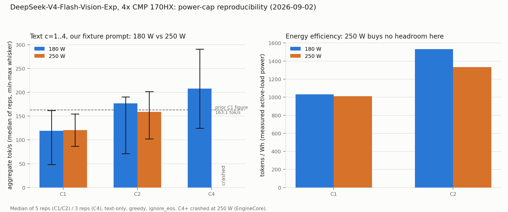
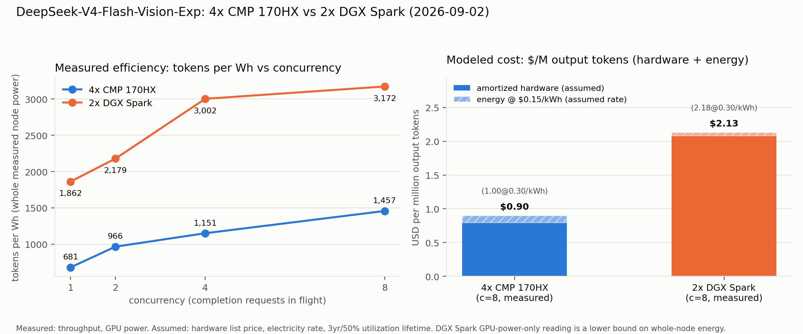

# Benchmarks

Results here are application measurements on the tested CMP 170HX setup. They are not vendor specifications or theoretical estimates. This page is the normalized comparison index; raw manifests, commands, and receipts stay in the model repositories.

## Evidence tiers

A row is **publication-safe** only when the full sanitized receipt chain (manifest, commands, redacted outputs, exact model/runtime pins) is merged in the owning model repository. Rows whose receipts are unmerged are **pending evidence repair**: their owning tickets repair the evidence chain, and the numbers are not decision-grade until then. The README scoreboard mirrors these statuses.

## Normalized matrix

`—` = not presented without sanitized stable evidence. Do not interpolate or compare unlike metrics.

| Workload | Quant / runtime | Cards | Context | Concurrency | Prefill | Decode | Aggregate | TTFT | ITL | Quality / success | Power / thermals | Energy | Status | Evidence |
|---|---|---|---|---|---:|---:|---:|---:|---:|---|---|---|---|---|
| GLM-5.3-Flash | EXL3 4.05bpw · exllamav3 1.4.6 + TabbyAPI | 4 · manual `gpu_split` | 32,768 (max_seq_len); ~2,048 effective per request under Q8 cache | c=1/2/4/8, 1 warmup + 3 reps | ~354 tok/s warm (2,941 in) | 26.9 tok/s (c=1) | 44.8 tok/s (c=8) | 0.39 s warm / 5.57 s cold | — | 20/20 golden corpus (keyword-match) | 234.7 W mean / 302.3 W peak (4-card total, C4); peak 49 °C, no Xid/ECC | — | Publication-safe | [Result card](../results/2026-09-03-glm-5.3-flash-exl3-4gpu-tabbyapi/README.md) · [Guide](models/glm-5.3-flash.md) |
| GLM-5.3-Flash | UD-IQ4_XS · llama.cpp (0069971) | 4 · layer split | 16,384 | c=1; ladder 1/2/4; soak c=2 | — | 17.73 tok/s median (c=1) | ~17.5–17.7 tok/s (c=2/4) | — | — | 21/26 local tasks · 41/41 soak reps | Snapshot only: 40.10–44.49 W, core 41–43 °C, mem 45–55 °C, VRAM 32,656–42,312 / 65,536 MiB; limit not queried | Snapshot proxy only, not integrated | Publication-safe; superseded by the EXL3 row above | [Run manifest](https://github.com/PixelML/GLM-5.3-Flash-CMP-170HX/blob/7fc71e00925f7b7902764aab7d08b6d923aaaea4/results/phase63/run-manifest.json) · [Result card](results/2026-08-30-glm-5.3-flash-ud-iq4xs-llamacpp-cmp170hx.md) |
| GLM-5.3-Flash | NVFP4 | 3 | — | — | — | — | — | — | — | — | — | — | Not compatible (SM121 weights on SM80) | [Negative results](#negative-results-matter) |
| Qwen3.8-27B | W4A16 AutoRound + DFlash2 k=7 · vLLM | 1 (3 cards tested) | 64k | c=1 | 1,946 tok/s | 136.38 tok/s (256 tok) / 122.00 (900 tok) | — | 190.8 ms | — | 3 cards, 3 runs | 180 W cap; peak 51 °C core / 61 °C memory | — | Measured 2026-08-30 | [Repo](https://github.com/PixelML/Qwen3.8-27B-CMP-170HX) |
| Qwen3.8-27B | Ninfer sm_80 fork, MTP spec-on vs. spec-off vs. vLLM+DFlash2 control | 1 | 64k | c=1 | — | 38.16 tok/s spec-on / 29.95 spec-off (control: 138.6 tok/s) | — | 2.1 ms (Ninfer, decode) | — | 3 samples/case | 180 W cap; peak 195.9–203.0 W, 67–69 °C (Ninfer, above cap reading) | — | Measured 2026-09-02, negative for Ninfer | [results/2026-09-02-qwen3.8-27b-ninfer-ab](../results/2026-09-02-qwen3.8-27b-ninfer-ab/README.md) |
| DeepSeek-V4-Flash-0731 | FP8 · SM80 vLLM fork · PP3 · DSpark k=5 | 3 | 16,384 | c=1, three prompt classes | 2,965 tok/s (5,399 in) | 83.3 tok/s aggregate (73.4 / 72.4 / 116.6) | — | — | — | 400 tok × 3 classes | 180 W cap | acceptance 5.07–5.32 | Measured 2026-08-30 | [Repo](https://github.com/PixelML/DeepSeek-V4-Flash-0731-CMP-170HX) |
| DeepSeek-V4-Flash-Vision-Exp | FP8 · SM80 vLLM fork | 4 · PP4 · DSpark k=6 | 16,384 | c=1; ladder 1/2/4/8/16 | 2,352 tok/s warm (362 tok/s first cold prefill) (2,941 input tokens) | 97.4 tok/s (median of 3; 57.6–123.5) (c=1) | 165.5 tok/s (median of 3; 140.3–203.2) @ c=4; failed (device-side assert, reproduced twice) @ c=16 | 0.394 s warm | — | Text passed; image not served on this path | — | — | Benchmark in progress; supersedes the earlier ladder | [Repo](https://github.com/PixelML/DeepSeek-V4-Flash-Vision-Exp-CMP-170HX) · [Section](#deepseek-v4-flash-vision-exp-four-cards) |
| DeepSeek-V4-Flash-Vision-Exp | FP8 → BF16 fallback · reference TP4 runtime + SM80 patches | 4 · TP4 | ≤ ~1,024 input tokens (OOM above) | batch 1 | 512 tokens in ~8.7–9.8 s | 0.88–0.93 tok/s (3 × 401 tokens) | — | ~2.05–2.08 s proxy | — | Real-image completion PASS; no-image and wrong-image controls PASS | — | — | Correctness evidence only, not a performance result | [Repo](https://github.com/PixelML/DeepSeek-V4-Flash-Vision-Exp-CMP-170HX) · [Milestone](#vision-correctness-milestone) |
| DeepSeek-V4-Flash-Vision-Exp | FP8 · SM80 vLLM fork | 4 · PP4 · DSpark k=6 | 262,144 (max-model-len; 65,000 verified) | c=1, prefill ladder only | 5,261 tok/s @ 65,000 in (2,397 @ 2,941 in) | not measured (crash before decode phase) | — | 12.36 s wall @ 65,000 in (proxy) | — | Needle/decode/vision untested — engine crash at 131,000-token fixture build | Peak 51 °C, no Xid/ECC | — | Partial; engine crash above 65k, not restarted | [Results](results/2026-09-02-deepseek-v4-flash-vision-exp-4card-longctx-262k/RESULTS.md) · [Section](models/deepseek-v4-flash-vision-exp.md#long-context-max-model-len-262144-measured-2026-09-02) |

## GLM-5.3-Flash EXL3 4.05bpw, four cards, exllamav3 + TabbyAPI (publication-safe)

**Measured 2026-09-02:** 4 × 64 GiB CMP 170HX, manual `gpu_split: [48, 48, 48, 48]` GB per card (not tensor-parallel — TP raises `NotImplementedError` for `Glm5NextForConditionalGeneration` in exllamav3 1.4.6), `max_seq_len: 32768`, `cache_size: 32768`, `cache_mode: Q8`, `reasoning: true`, drafting disabled. Model: `turboderp/GLM-5.3-Flash-exl3`, branch `4.05bpw`, revision `2a30229e67012798ba9f0cd832bb78abf4c363d5`. Runtime: exllamav3 1.4.6+cu128.torch2.10.0, served via TabbyAPI. This replaces the UD-IQ4_XS GGUF row below as the recommended recipe for this checkpoint family.

**Context-length update (resolved 2026-09-03):** with `cache_mode: Q8`, any single request whose context exceeds about 2,048 tokens fails with a 503 — GLM-5.3-Flash's DeepSeek Sparse Attention path (`index_topk: 2048`) does not support a quantized MLA cache in this exllamav3 build. Switching to `cache_mode: FP16` lifts the cap: validated up to 262,144-token context (250,000 prompt tokens tested, no OOM/crash), now the recommended default for long context. The concurrency ladder below is at `cache_mode: Q8` / short context and was not re-run at 262k. Full detail: [docs/models/glm-5.3-flash.md](models/glm-5.3-flash.md#context-limit-q8-cache-and-dsa-resolved-2026-09-03).

| Concurrency | Aggregate tok/s (mean of 3 reps) | Mean per-request tok/s |
|---|---:|---:|
| C1 | 26.9 | 26.9 |
| C2 | 31.1 | 15.6 |
| C4 | 41.7 | 10.5 |
| C8 | 44.8 | 8.3 |

| Metric | Value |
|---|---:|
| Prefill, warm (2,941-token prompt) | ~354 tok/s |
| TTFT, cold / warm | 5.57 s / 0.39 s |
| Golden corpus (20 prompts, keyword-match) | 20/20 |
| n-gram speculative decoding | -7.2% vs. no draft (shipped with drafting disabled) |
| Power, C4 load run (4-card total) | 234.7 W mean / 302.3 W peak |
| Peak core temperature | 49 °C, no Xid/ECC through c=8 |
| Per-card VRAM | GPU0 48,468 / GPU1 47,982 / GPU2 47,982 / GPU3 12,084–12,116 MiB |

Reasoning must be enabled (`reasoning: true`) or chain-of-thought leaks into `content`; `max_tokens >= 128` is needed for short factual answers even with reasoning parsed correctly (`max_tokens=32` reproducibly returns `content: null`). Full write-up, boot-topology notes, and the executed notebook: [docs/models/glm-5.3-flash.md](models/glm-5.3-flash.md), [notebooks/2026-09-03-glm-5.3-flash-exl3-4gpu-tabbyapi.ipynb](../notebooks/2026-09-03-glm-5.3-flash-exl3-4gpu-tabbyapi.ipynb), [results/2026-09-03-glm-5.3-flash-exl3-4gpu-tabbyapi/](../results/2026-09-03-glm-5.3-flash-exl3-4gpu-tabbyapi/README.md).

## GLM-5.3-Flash UD-IQ4_XS, four cards (publication-safe, superseded by the EXL3 recipe above)

**Measured:** 4 × 64 GiB CMP 170HX, layer split (`--tensor-split 1,1,1,1`), 16,384 context, unslothai/llama.cpp at commit 00699716c275498ff84d71e329178fe21cba56a6, driver 610.43.03, kernel 6.8, Ubuntu 22.04. Model: unsloth/GLM-5.3-Flash-GGUF at revision 2975ab414d30340466d8c51533c6e91f0cca64c1, 5-shard UD-IQ4_XS (~146 GiB).

| Metric | Value |
|---|---:|
| Decode, c=1 median (5 reps after 3 warmups) | 17.73 tok/s |
| End-to-end per task, c=1 | 14.44 s |
| Aggregate, c=2 and c=4 ladder (2 reps each) | ~17.5–17.7 tok/s (flat) |
| Soak, 20 min at c=2 | 41/41 reps ok, stable 17.5→17.7 tok/s |
| Quality, corrected 26-task pack | 21/26 (math 8/8, instruction 4/5, long-context 3/3, held-out math 4/4, held-out code 1/1, coding 1/3, held-out instruction 0/2) |
| Prefill / TTFT / ITL | — (not captured in sanitized receipts) |
| Power, end-of-run snapshot per card | 40.10 / 44.49 / 40.64 / 41.82 W (configured limit not queried) |
| Temperatures, end-of-run snapshot | core 41–43 °C, memory 45–55 °C (continuous/peak not recorded) |
| VRAM, end-of-run snapshot per card | 32,656–42,312 of 65,536 MiB |
| Energy | single-snapshot power proxy; not integrated energy and not a lower bound |
| Fault telemetry | continuous throttle/Xid/thermal telemetry not recorded this run; no fault-free-operation claim is made |

Aggregate curve flatness beyond c=4 and at longer contexts is untested. Result card: [results/2026-08-30-glm-5.3-flash-ud-iq4xs-llamacpp-cmp170hx.md](results/2026-08-30-glm-5.3-flash-ud-iq4xs-llamacpp-cmp170hx.md).

## Qwen3.8-27B NVFP4, one card — pending evidence repair

**Status:** the canonical sanitized receipts for the three-card runs are unmerged ([repo PR 1](https://github.com/PixelML/Qwen3.8-27B-CMP-170HX/pull/1)). The numbers below are platform context, not decision-grade, until that repair lands.

**Measured (context):** three separate CMP 170HX cards at a 180 W limit.

| Card | Decode, 256 output tokens | Decode, 900 output tokens | TTFT | Prefill |
|---|---:|---:|---:|---:|
| 0 | 135.31 tok/s | 121.28 tok/s | 201.2 ms | 1,957.3 tok/s |
| 1 | 140.27 tok/s | 124.78 tok/s | 189.7 ms | 1,954.7 tok/s |
| 2 | 133.57 tok/s | 119.94 tok/s | 181.4 ms | 1,926.0 tok/s |
| Mean | **136.38 tok/s** | **122.00 tok/s** | **190.8 ms** | **1,946.0 tok/s** |

Peak observed core temperature was 51 °C; peak observed memory temperature across the three runs was 61 °C. A single-card hosted reference reported 147.7 tok/s at 255 W; it is context, not a controlled apples-to-apples comparison.

Reproduction and raw outputs: [PixelML/Qwen3.8-27B-CMP-170HX](https://github.com/PixelML/Qwen3.8-27B-CMP-170HX).

## Qwen3.8-27B runtime A/B: vLLM vs. Ninfer sm_80 fork (measured 2026-09-02)

**Verdict: stay on vLLM + DFlash2.** The `Ithrial/ninfer-cmp170hx` sm_80 fork,
run with its own MTP speculative decoding, is 3.6x slower on decode256 than
the vLLM + DFlash2 control (38.16 vs. 138.6 tok/s) despite a higher measured
SM clock (1455 MHz vs. the control's 1170-1200 MHz sustained). With Ninfer's
speculation off, the gap widens to 4.6x (29.95 tok/s). The fork's peak power
draw (195.9-203.0 W) exceeded the 180 W cap reading configured on the card,
which is flagged as an open question about how the fork interacts with the
driver's power limit, not folded into the speed verdict.

| Metric | vLLM + DFlash2 (control) | Ninfer spec-on (MTP) | Ninfer spec-off |
|---|---:|---:|---:|
| decode256 | 138.6 tok/s | 38.16 tok/s | 29.95 tok/s |
| decode900 | 123.4 tok/s | 39.15 tok/s | 29.55 tok/s |
| Peak power | 190.5 W | 195.9 W | 203.0 W |
| Peak SM clock | 1170-1200 MHz sustained | 1455 MHz | 1455 MHz |

A prior attempt at this fork had crashed at warmup
(`gqa_attention_prefill.cu:64: CUDA_CHECK ... invalid argument`); that crash
did not recur on this run. Full protocol, per-sample data, and a
bandwidth-ceiling estimate:
[results/2026-09-02-qwen3.8-27b-ninfer-ab](../results/2026-09-02-qwen3.8-27b-ninfer-ab/README.md).

## DeepSeek-V4-Flash-0731, three cards — pending evidence repair

**Status:** canonical sanitized receipts are unmerged ([repo PR 1](https://github.com/PixelML/DeepSeek-V4-Flash-0731-CMP-170HX/pull/1)). Numbers below are platform context until the repair lands.

**Measured (context):** 3 × 64 GiB cards, pipeline parallel size 3, 180 W/card, FP8 KV cache, 16,384 maximum sequence length, and speculative decoding with `k=5`.

| Prompt class | Decode throughput |
|---|---:|
| Technical | 73.4 tok/s |
| Prose | 72.4 tok/s |
| Code | 116.6 tok/s |
| Aggregate | **83.3 tok/s** |

Measured prefill reached 2,965 tok/s at 5,399 input tokens. Draft-token acceptance ranged from 5.07 to 5.32 tokens, or roughly 81–86%. The 48-shard checkpoint was about 148 GB. Cold startup included approximately 22 minutes of weight loading from shared storage plus approximately seven minutes of CUDA graph capture.

The precompiled runtime image lacked `vllm._C` for this path; a source build was required. Full details: [PixelML/DeepSeek-V4-Flash-0731-CMP-170HX](https://github.com/PixelML/DeepSeek-V4-Flash-0731-CMP-170HX).

## DeepSeek-V4-Flash-Vision-Exp, four cards

**Checkpoint:** `deepseek-ai/DeepSeek-V4-Flash-Vision-Exp`, FP8 e4m3 weights,
48 shards, revision `86f746b36186f0e567729a5c06a8c918caba82a9`.
**Hardware:** 4 × 64 GiB CMP 170HX, driver 610.43.03, kernel 6.8, Ubuntu 22.04.
Detailed receipts, launch scripts, and patches live in
[PixelML/DeepSeek-V4-Flash-Vision-Exp-CMP-170HX](https://github.com/PixelML/DeepSeek-V4-Flash-Vision-Exp-CMP-170HX).

Three runs exist on this checkpoint. The text-only vLLM run and the
vision-enabled vLLM run (Path 3, below) share the same SM80 fork and the
same PP4 + DSpark k=6 recipe; the third, older TP4 reference run is kept
as history. Do not combine numbers across runs without checking which
one produced them.

### Text path: PP4 + DSpark k=6 (benchmark in progress)

**Setup:** SM80 vLLM fork, pipeline parallel size 4 with layer partition
`11,11,11,10`, 16,384 maximum model length, 2,048 maximum batched tokens,
FP8 KV cache, DSpark speculative decoding with `k=6`. Greedy decoding, 400
completion tokens per request, warm engine, token counts from final usage
objects, three repetitions per level.

| Metric | Value |
|---|---:|
| Decode, c=1 | 97.4 tok/s (median of 3; 57.6–123.5) |
| Aggregate, c=4 | 165.5 tok/s (median of 3; 140.3–203.2) |
| Aggregate, c=16 | failed (device-side assert, reproduced twice) |
| Uncached prefill, 2,941 input tokens | 2,352 tok/s warm (362 tok/s first cold prefill) |
| Warm TTFT | 0.394 s |
| Aggregate, c=2 | 103.7 tok/s (median of 3; 96.6–159.2) |
| Aggregate, c=8 | 220.2 tok/s (median of 3; 206.3–232.0) |

The placeholders are filled when the normalized run completes and its receipts
merge in the model repository. Until then this table is not decision-grade.

Full tables, per-request spread, telemetry, and the throughput-vs-concurrency
chart are in the executed notebook:
[notebooks/2026-09-02-deepseek-v4-flash-vision-exp-4card-pp4-vllm.ipynb](../notebooks/2026-09-02-deepseek-v4-flash-vision-exp-4card-pp4-vllm.ipynb).
Raw receipts: [results/2026-09-02-deepseek-v4-flash-vision-exp-4card-pp4-vllm/](../results/2026-09-02-deepseek-v4-flash-vision-exp-4card-pp4-vllm/).

**Earlier run, superseded.** An earlier ladder on the same topology reported
101.21 / 114.68 / 169.65 / 133.95 tok/s aggregate at c=1 / 2 / 4 / 8, with a
c=16 wedge in the speculative draft path. A separate mixed-content single-stream
run reported 59.78 tok/s warm decode, 0.163 s warm TTFT, and 325.5 tok/s
uncached prefill. The two runs used different protocols, and the runtime
source revision was unavailable from the running image. The numbers stay
visible as measured learning, but they are superseded by the normalized run.
Snapshot: [result summary](../results/2026-08-31-deepseek-v4-flash-vision-exp-cmp170hx.md).

### Vision on vLLM, SM80 (Path 3, measured)

**Setup:** the same SM80 vLLM fork and PP4 + DSpark k=6 recipe as the text
path above, with five additional fixes that let the vision path boot (eager
weight-load host-RAM pressure, a missing multimodal-processor plan-API
shim, the processor never returning `input_ids`, a missing
`process_weights_after_loading()` call that left broadcast weights
unfinalized, and a CUDA-graph capture path that nulled `input_ids` on
non-first pipeline ranks). Full detail, commits, and tracebacks are in the
executed notebook's appendix and in
[docs/LESSONS.md](LESSONS.md).

| Metric | Value | Status |
|---|---:|---|
| Functional gates (`/v1/models`, deterministic greedy, image keyword match) | PASS, 10/10 image keyword match | Measured 2026-09-02 |
| Golden corpus, text (20 rows) | 15/20 keyword match, 10/20 exact-match vs. DGX Spark reference | Measured 2026-09-02, known limitation |
| Decode, c=1, text-only | 119 tok/s median of 5 reps (peak 162) aggregate | Measured 2026-09-02; DSpark acceptance variance (0.20-0.83) drives the run-to-run spread |
| Decode, c=2, text-only | 116.6 tok/s aggregate (median of 3) | Measured 2026-09-02 |
| Decode, c=4, text-only | server crashed on rep 3 of 3 | Measured 2026-09-02 |
| Decode, c=8 / c=16, text-only | not measured | Not measured, server stayed down after the c=4 crash |
| Decode, c=1, text+one-image | 45.3 tok/s aggregate (median of 3) | Measured 2026-09-02 |
| Decode, c=2, text+one-image | 78.2 tok/s aggregate (median of 3) | Measured 2026-09-02 |
| Decode, c=4 through c=16, text+one-image | not attempted | Not attempted, given the text-only crash at c=4 |
| Uncached prefill, 2,941 input tokens | 2,352 tok/s warm (918 tok/s first cold prefill) | Measured 2026-09-02 |
| Warm TTFT | 0.386 s | Measured 2026-09-02 |

**The c=4 crash.** During the text-only concurrency ladder, at c=4, rep 3
of 3, the vLLM `EngineCore` process died with `RuntimeError: cancelled` in
the shared-memory broadcast queue (`shm_broadcast.py`, `acquire_read`). All
4 in-flight requests received `HTTP 500`, and the server container exited
on its own (exit code 0). Per the standing operating instruction for this
endpoint, the session did not restart it. It came back up later under
infrastructure outside this session's control; once it answered
`/v1/models` again, the text+image ladder ran clean at c=1 and c=2, and
c=4 and above were deliberately left alone given the crash history at
that level. c=8 and c=16 text-only stayed unmeasured. GPUs stayed at
42-47 C through the crash and after, with no Xid or ECC events.

**Text exact-match gap.** The golden corpus's text rows show a real
correctness gap against the DGX Spark reference (10/20 exact-match, 4/20
`finish_reason` mismatches) that is not a crash or stability signal. Image
correctness is solid (10/10 keyword match). The likely cause is SM80
kernel numerics plus the `dspark` speculative-decode draft model changing
greedy continuations at temperature 0; see
[docs/LESSONS.md](LESSONS.md) for the full discussion.

Full protocol, the chart, and the appendix are in the executed notebook:
[notebooks/2026-09-02-deepseek-v4-flash-vision-exp-4card-vision-pp4-vllm.ipynb](../notebooks/2026-09-02-deepseek-v4-flash-vision-exp-4card-vision-pp4-vllm.ipynb).
Raw receipts: [results/2026-09-02-deepseek-v4-flash-vision-exp-4card-vision-pp4-vllm/](../results/2026-09-02-deepseek-v4-flash-vision-exp-4card-vision-pp4-vllm/).

### Reproducibility and power cap (2026-09-02)

A follow-up run checked whether the 163.1 tok/s c=1 figure above holds up
under more reps, and whether raising the per-card power cap from 180 W to
250 W changes decode throughput. Same server, same PP4 + DSpark k=6 recipe,
text-only prompts. Two measurement protocols ran side by side at each
concurrency level: **ours** (our 2,941-token fixture prompt, 400-token
non-streaming completions, `aggregate_tok_s = total_completion_tokens /
wall_s`) and **mia** (MiaAI-style: a fresh 256-token prompt per request,
128-token forced streaming decode, decode tok/s measured after the first
token). Reps: warmup(1) + 5 at c=1/c=2, warmup(1) + 3 at c=4/c=8, one
attempt at c=16. Tokens are read from the API's final `usage` object in
both protocols.

| Level | Protocol | 180 W median (min-max) | 250 W median (min-max) |
|---|---|---:|---:|
| C1 | ours (2,941-tok fixture) | 118.95 (48.5-161.7) | 120.42 (86.9-154.7) |
| C1 | mia (256-tok, decode-only) | 134.67 (57.8-141.0) | 138.10 (79.0-145.6) |
| C2 | ours | 176.59 (71.4-190.3) | 158.75 (102.3-201.3) |
| C2 | mia | 235.83 (141.0-239.4) | 241.38 (177.2-267.8) |
| C4 | ours | 207.59 (124.5-290.7) | crashed on warmup |
| C4 | mia | 363.51 (328.5-402.0) | crashed on warmup |
| C8 | ours | 1/2 reps succeeded (193.46 tok/s), then crashed | crashed on warmup |
| C16 | any | wedged, server already down | wedged, same |

**The 163 tok/s figure: reproduced as a peak, not as a stable median.** The
prior figure was a median of 3 reps at 163.1 tok/s. This run's same
protocol, 5 reps, put the 180 W median at 118.95 tok/s — the top of this
run's range (161.7) sits within 1% of the old median, but the 5-rep median
sits about 27% below it. C1 aggregate tok/s on this recipe swings roughly
50-180 tok/s run to run. Draft-acceptance ratio (DSpark, accepted / draft
tokens) swings from about 0.20 to 0.83 across reps, and the low-ratio reps
are the same reps with the lowest tok/s — that is the main source of the
spread, not the power cap. **Anyone quoting a single C1 number for this
recipe should quote 119 tok/s median of 5 reps (peak 162), not 163.**

**250 W: no measurable throughput gain.** At C1/C2 — the only levels both
power caps completed cleanly — 250 W bought +1% to +5% on most lanes, well
inside the run-to-run spread above (one lane, C2 ours, showed -10%, likely
the same noise in the other direction). Measured active-load power (4-card
total, C2 ours burst): 414.8 W at the 180 W cap versus 428.8 W at the
250 W cap, only +3.4% more power drawn — this decode workload at
concurrency <= 2 is latency-bound, not power-bound, so the higher cap is
never actually pushed against. Tokens per Wh at C1/C2 came out flat to
worse at 250 W. 180 W is kept as the standing default; whether 250 W helps
at c=4+ is untested, because both arms lost the server to the crash below
before reaching that concurrency cleanly.

**Concurrency ceiling, both arms.** 180 W stayed up through c=4 and crashed
mid-c=8 (`EngineCore`, `shm_broadcast.acquire_read`, `RuntimeError:
cancelled`); 250 W crashed earlier, at c=4 on warmup, same error signature.
Both crashes happened with GPUs at 41-58 C core / 47-63 C memory, well
under the 80 C / 85 C stop thresholds — not a thermal event. One data point
is not enough to say the 250 W cap causes the earlier crash, but it is the
only variable that changed between the two arms, so it is flagged for a
future run. Read this together as: **stable through c=2 on both arms;
c=4 is a coin flip depending on power cap; every arm is down by c=8.**
Tracked, not fixed.

**Harness telemetry bug (disclosed).** The continuous 1 Hz power/clock/temp
sampler queried the wrong `nvidia-smi` field name for this run and produced
empty CSVs for both arms; every sample failed and was dropped instead of
raising. Fixed in the harness after the fact. In its place: manual 60 s
`nvidia-smi` checks during both live runs enforced the 250 W stop condition
in real time (max observed 58 C core / 63 C memory, no stop triggered), and
two short supplementary C2 bursts with working telemetry produced the
power/tok-per-Wh figures above. 180 W was restored and verified on all 4
cards at the end of the run.

Full receipts, per-rep numbers, and the chart source:
[results/2026-09-02-deepseek-v4-flash-vision-exp-4card-repro-power/](../results/2026-09-02-deepseek-v4-flash-vision-exp-4card-repro-power/).

### Vision-correctness milestone (history)

**Result:** the first real-image inference of this checkpoint on Ampere (SM80)
hardware. The runtime is the reference TP4 (tensor parallel 4) implementation
plus SM80 fallback patches. The server passed `/v1/models`, a deterministic
text request, a real 64 × 64 gradient-image request (the model named the
gradient colors, which appear nowhere in the prompt), and no-image and
wrong-image controls.

SM80 fallback patches on the reference path:

- block-scale broadcast fix for the FP8 block-scaled weights;
- pure-torch Sylvester Hadamard transform in place of the CUDA
  `fast_hadamard_transform` extension (exactness checked: `H @ H.T = n * I`);
- sinkhorn layout fix in the hyper-connection split fallback (flat
  `pre | post | comb` layout instead of an `(m, m+2)` grid);
- FP4 dequant to BF16 with a BF16 GEMM fallback for linear layers, because
  the tilelang FP8 × FP4 GEMM raises a device assert on SM80 (it requires
  SM89 FP8 MMA); the vision tower runs BF16 SDPA.

| Metric (TP4 reference runtime, NVMe-staged weights) | Value |
|---|---:|
| Decode, c=1, greedy 401 tokens, 3 reps | 0.88–0.93 tok/s (about 0.9 tok/s) |
| Wall time per 401-token completion | 431–454 s |
| Prefill, 512 input tokens | 8.7–9.8 s wall |
| Prefill, 256 input tokens | 7.4–7.5 s wall |
| TTFT proxy, 3 reps | 2.05–2.08 s |
| Single-request prefill, ≥ ~1,024 tokens | OOM (7.8–11.5 GiB sparse-attention allocation against 2–7 GiB free) |
| Weights resident per card | about 44.4 GiB |

**This is correctness evidence, not a performance result.** The reference
runtime serves one request at a time, does not stream, has no speculative
decoding, and dequantizes to BF16 on the fly. Its decode rate says nothing
about what the vLLM text path can reach. Do not place 0.9 tok/s beside any
other row on this page. This milestone predates Path 3 and is kept as
history; the vLLM-served vision benchmark is the section above.

### SM80 compatibility gaps in the upstream Vision vLLM path (route not taken)

The pinned upstream Vision vLLM source assumes SM90-class kernels in several
places. Each gap below stopped a four-rank PP4 boot at a different stage,
on the pinned reference Vision head (Route B), a different code path from
the SM80 text-path fork that Path 3 (above) later reverse-ported vision
onto successfully. The gaps were found one at a time, in this order,
because each one only appears after the previous one is fixed.

| # | Stage | Failure | Root cause | Status |
|---|---|---|---|---|
| 0 | Weight load | Workers killed by the host OOM killer at 7 of 48 shards, no traceback | The eager safetensors load strategy reads each whole shard into host RAM; 4 ranks × concurrent whole-shard reads exhausted 94 GiB of host RAM | Fixed: drop the eager strategy and use streaming `safe_open` |
| 1 | KV-cache profiling | `RuntimeError: DeepGEMM backend is unavailable` on the first pipeline rank | The MHC broadcast path calls the DeepGEMM TF32 prenorm GEMM unconditionally; upstream gates the fallback on package presence, not on architecture support | Fixed: Triton fallback, selected with an architecture-aware predicate (`is_deep_gemm_supported()`) |
| 2 | Attention profiling | Triton compile error `type fp8e4nv not supported in this architecture` | The fused inverse-RoPE FP8 quantization kernel for `o_proj` stores `fp8e4nv`, which this Triton build cannot emit for sm_80 | Fixed: torch BF16 fallback, gated on compute capability < 9 |
| 3 | KV-cache warmup | NVVM backend compilation failed for target sm_80 | The CuteDSL `fused_indexer_q` RoPE + FP8 quantization kernel does not compile for sm_80; the Triton alternative also stores `fp8e4nv` | Fixed: pure-torch fallback that reproduces the Triton numerics (GPT-J interleaved RoPE, power-of-two per-token scales); SM90+ path unchanged |
| 4 | First multimodal request | `vision MoE routing requires input_ids` under pipeline parallel | Structural: the vision MoE router reads `input_ids` to route image tokens, and non-first pipeline ranks receive hidden states only, never `input_ids` | Unresolved. The route is frozen; image requests are not served on the PP4 vLLM path |

Gaps 1–3 are capability-gated so that the SM90+ path is byte-identical. Gap 4
stopped Route B for good; it is why the TP4 reference runtime carried the
vision-correctness milestone until Path 3 (a separate fork with its own
`requires_raw_input_tokens` handling, see the section above and
[docs/LESSONS.md](LESSONS.md)) solved the equivalent problem on the SM80
vLLM path.

### Negative results, four cards

- **The reference TP4 runtime is batch 1.** It is not a serving engine. No
  concurrency ladder was run on it, and none should be.
- **Shared-storage load is slow.** The checkpoint streamed from NFS at about
  31 MiB/s aggregate. A cold start took about 30–45 minutes of weight loading
  before profiling and graph capture began. Staging the weights on local NVMe
  removed this cost.
- **2,941-token prefill OOM on the reference TP4 path.** With about 44.4 GiB
  of weights per card, the sparse-attention fallback needs 6.8 GiB per rank
  for a 2,941-token request and 7.8 GiB for a 2,048-token request. Both
  exceeded the free memory. Reliable single-request prefill on this path is
  below about 1,024 tokens.
- **NVRM VA-space corruption after an OOM kill storm.** After the four ranks
  were killed mid-prefill, the kernel log showed NVRM assertion failures on
  all four GPUs, and CUDA initialization failed host-wide
  (`CUDA_ERROR_NO_DEVICE`). ECC and retired-page counters stayed clean.
  Reloading `nvidia_uvm` alone did not help. A full `rmmod nvidia_uvm nvidia`
  and `modprobe nvidia nvidia_uvm` sequence restored the devices without a VM
  reboot. Treat this as a driver-state hazard whenever a multi-rank OOM
  occurs.
- **Only one PP4 partition boots.** Layer partitions `12,12,12,7` and
  `12,12,11,8` failed before serving traffic (exit 137 and a first-request
  device-side assert). `11,11,11,10` is the only stable partition found on
  this checkpoint.

### Cross-platform context: two-node DGX Spark

The same checkpoint at the same revision runs on a two-node DGX Spark kit
(GB10, vLLM, TP=2, `fp8_ds_mla` KV cache). Published there (merged evidence): c=1 36.9 tok/s, c=6 112.7 tok/s
aggregate, uncached prefill 1,789 tok/s, streaming TTFT 0.239 s, vision PASS.
A later normalized run on the 2,941-token / 400-token protocol (c=1 48.7,
c=16 106.8 aggregate) is in that repository's open PR and is not yet merged. Results and
receipts: [PixelML/DeepSeek-V4-Flash-Vision-Exp-DGX-Spark](https://github.com/PixelML/DeepSeek-V4-Flash-Vision-Exp-DGX-Spark).

This is context, not a head-to-head comparison. The platforms differ in
runtime revision, parallelism, memory budget, interconnect, and power. The
DGX Spark path serves images through upstream vLLM; the CMP path does not.

### Cross-platform: 4x CMP 170HX vs 2x DGX Spark

Same checkpoint, same date, two purpose-built runs: one on the four-card
CMP 170HX rig at PP4 + DSpark k=6, one on a two-node DGX Spark kit at TP=2.
Both used the same protocol: greedy decoding, 400 completion tokens,
`ignore_eos`, one warmup plus three reps per concurrency level, tokens
counted from the final `usage` object. Full receipts, raw power logs, and
the chart script are in
[results/2026-09-02-cross-platform-cost-watt/](../results/2026-09-02-cross-platform-cost-watt/).

| Concurrency | CMP 170HX tok/s | CMP 170HX tok/Wh | DGX Spark tok/s | DGX Spark tok/Wh |
|---|---|---|---|---|
| 1 | 97.4 | 681 | 37.7 | 1,862 |
| 2 | 103.7 | 966 | 48.4 | 2,179 |
| 4 | 165.5 | 1,151 | 73.5 | 3,002 |
| 8 | 220.2 | 1,457 | 81.1 | 3,172 |

At c=8, the CMP rig moves more tokens per second, but the Spark nodes move
more tokens per watt-hour. The CMP 170HX draws four cards at up to 180 W
each; the DGX Spark reading is GPU power only, so it undercounts the rest
of the node and should be read as a lower bound.

Cost tells a third story. At an assumed $8,300 for four CMP 170HX cards
plus a host, and $8,000 for two DGX Spark units, amortized over three years
at 50% utilization:

| Platform (c=8) | Amortized hardware | Energy @ $0.15/kWh | Energy @ $0.30/kWh | Total @ $0.15/kWh |
|---|---|---|---|---|
| 4x CMP 170HX | $0.80 / M tok | $0.10 / M tok | $0.21 / M tok | $0.90 / M tok |
| 2x DGX Spark | $2.09 / M tok | $0.05 / M tok | $0.09 / M tok | $2.13 / M tok |

The CMP rig wins on cost per token because it moves more tokens per
second, and the hardware cost is split across more of them. The Spark
nodes win on power efficiency because GB10's unified memory draws far less
than four discrete GPUs. Neither number is free of assumptions: hardware
prices, electricity rate, and the three-year/50%-utilization lifetime are
all inputs we chose, not measurements. Throughput and GPU power are
measured; everything downstream of them is a model.

**Three-line summary:** At c=8, 4x CMP 170HX serves DeepSeek-V4-Flash-Vision-Exp
at 220 tok/s for about $0.90 per million output tokens; 2x DGX Spark serves
the same checkpoint at 81 tok/s for about $2.13 per million, using roughly
half the power per token. Pick the CMP rig for throughput per dollar, and
the Spark nodes for throughput per watt.

### Credits

The SM80 vLLM fork, the DSA/MTP kernels, and the four-card reference recipe
come from [allover326/vllm-dsa-mtp-sm80](https://github.com/allover326/vllm-dsa-mtp-sm80)
and [allover326/deepseek-v4-cmp170hx](https://github.com/allover326/deepseek-v4-cmp170hx).
The SM80 fallback patches above extend that work. The three-card baseline
is [PixelML/DeepSeek-V4-Flash-0731-CMP-170HX](https://github.com/PixelML/DeepSeek-V4-Flash-0731-CMP-170HX)
(83.3 tok/s aggregate decode, PP3, DSpark k=5).

## Negative results matter

### GLM-5.3-Flash NVFP4

**Compatibility result, not a performance result:** the published NVFP4 artifact targets an SM121 runtime path and is not directly compatible with the SM80 CMP 170HX. An AWQ INT4 alternative was measured at about 198.1 GiB of safetensors, or roughly 66 GiB per card under simple three-way sharding before runtime/KV overhead, so it does not fit 3 × 64 GiB as-is.

Do not advertise a throughput number until a compatible model format, runtime path, and memory plan are demonstrated.

## Measurement rules

Every submitted result must include:

- exact model repository + revision and quantization;
- runtime image/commit, CUDA, driver, kernel, and launch command;
- card count, parallelism, PCIe topology, power limit, peak draw, and temperatures;
- input/output tokens, concurrency, batch size, context length, warmup, and sample count;
- raw redacted output and an explanation of the metric calculation.

For server-sent-event APIs, count generated tokens from the final `usage.completion_tokens`. Counting stream events produced incorrect results in an earlier harness because events are not tokens.

Rows marked `pending evidence repair` are restored to full decision-grade status only when the owning model repository merges the sanitized receipt chain, and the README scoreboard is updated in the same workflow.

Use the template in [results/README.md](../results/README.md).
