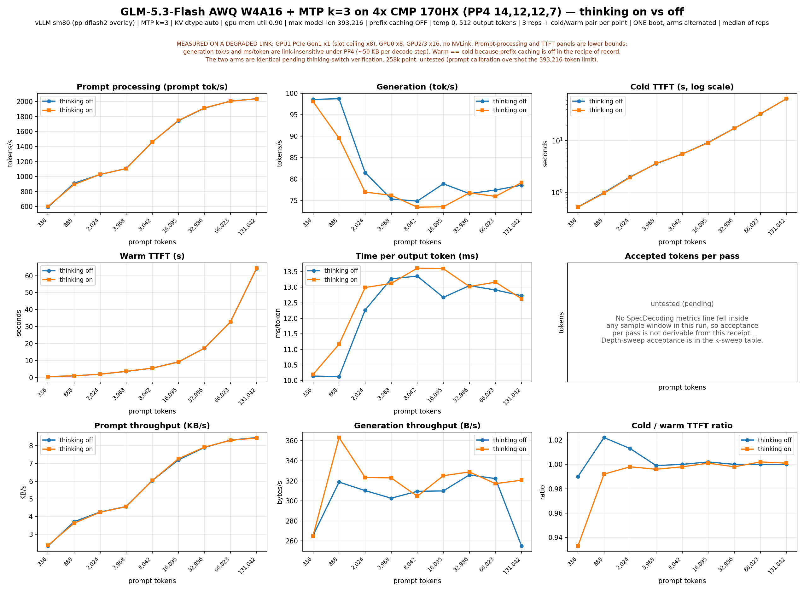

# GLM-5.3-Flash on CMP 170HX

> **Status: research preview.** Section 6 is complete for the recipe of record
> except for the lossless and sustained-stability cells; section 7 (quality) is
> unmeasured for that recipe and carries only the older EXL3 lane's gate. Both
> are named as `untested (pending)` where they appear.

## 1. Summary

| | |
|---|---|
| Model | GLM-5.3-Flash (45 hidden layers, sparse-MLA attention, one native MTP layer) |
| Hardware pool | 4x CMP 170HX (SM80, 64 GiB HBM2e each, 256 GiB aggregate), 180 W per-card cap, no NVLink, no P2P over PCIe |
| **Recipe of record** | **PP4 + native MTP k=3, AWQ W4A16, vLLM sm80** — 87.6 tok/s c=1 decode (P1 math, clean), 67.9 tok/s c=1 (P2 median), 78.4 tok/s best aggregate at c=16 |
| Superseded | TP4 + MTP k=3, same checkpoint — 60.4 tok/s c=1 median. TP is link-bound on this fabric; see section 8 |
| Alternative lane | EXL3 4.05 bits/weight on exllamav3 + TabbyAPI — 25.2 tok/s c=1, 44.6 tok/s at c=8, 262,144-token context validated |
| Superseded fallback | UD-IQ4_XS GGUF on a llama.cpp SM80 fork — 17.73 tok/s c=1 |
| A100-class comparison | untested — no A100 in the pool |
| Release state | research preview |
| Last measurement | 2026-09-05 (PP4 lane); 2026-09-03 (EXL3 lane) |

Two facts shape every number on this page.

**Pipeline parallelism beats tensor parallelism here.** This node has no NVLink,
so every TP all-reduce crosses PCIe and the topology runs at the width of its
worst rank. PP4 moves one hidden state — roughly 50 KB — per decode step. When
one card's link retrained from x8 to x1, the identical TP4 recipe fell from 70.5
to 14.4 tok/s under the identical protocol while PP4 held 60.8 tok/s on the same
box.

**Acceptance, not draft depth, is the lever.** Per-verified-token cost on this
box is not flat, so deeper MTP drafts do not pay for themselves: k=3 is the
record, and the community block drafter, which is a large win on the upstream
author's NVFP4 checkpoint, is a net loss on our AWQ one.

## 2. Requirements

| Format | Bits | GiB per card | Cards needed | Aggregate GiB | Link assumption | Status |
|---|---|---|---|---|---|---|
| AWQ W4A16 (compressed-tensors) | 4 | 45.5 per PP stage at PP4 | 4 | ~178 weights + KV | PCIe Gen1 tolerated under PP4; TP4 needs a healthy link on every rank | measured |
| EXL3 | 4.05 | 48 configured (`gpu_split`), 12-48 used | 4 | ~153 used | manual split, not tensor-parallel | measured |
| UD-IQ4_XS GGUF | ~4.25 | fits | 4 | — | any | measured, superseded |
| NVFP4 | 4 | 181 GiB checkpoint on disk | 4 | pending | pending | **untested (pending)** — boot in flight; also needs ~181 GiB of free staging space |
| AWQ-INT4 (cyankiwi) | 4 | ~49.5 at TP4 | 4 | 198.1 | — | negative: `glm5_next` absent from the upstream vLLM model registry |
| EXL3/TR3 | 4 | ~40.9 at TP4 | 4 | — | — | negative: ships SM121-only kernel binaries |
| Official FP8 / BF16 | 8 / 16 | 76+ (FP8) | — | — | — | negative: does not fit |

## 3. Recommended settings

For the recipe of record, verified on 2026-09-05 unless stated otherwise.

| Setting | Value | Verification |
|---|---|---|
| Sampling, throughput bench (P1) | temperature 0, 512 output tokens, 3 reps | measured 2026-09-05 |
| Sampling, throughput bench (P2) | temperature 0.7, `ignore_eos`, 512 output tokens, 5 reps | measured 2026-09-05 |
| `max_tokens` for short factual answers | **>= 128** | measured — this model reasons before answering; a 32-token budget returns an empty answer |
| Max context tested | 131,042 prompt tokens (server configured to 393,216) | measured 2026-09-05 |
| Reasoning / thinking mode | `chat_template_kwargs: {"enable_thinking": <bool>}` | **untested (pending)** — the probe returned no `reasoning_content` in any arm and the two sweep arms are statistically identical, so the switch is not yet proven to change the served path on this build |
| Prefix caching | off (`--no-enable-prefix-caching`) | measured — this is why warm TTFT equals cold TTFT throughout section 6 |
| KV dtype | `auto` | measured — fp8 KV is rejected by the Triton MLA backend on this build |
| Draft depth | native MTP, `num_speculative_tokens=3` | measured — full sweep in section 6 |
| Tool-call parser | untested (pending) | no tool-call cell has been run on this recipe |

For the EXL3 lane, `reasoning: true` is **required**: with it left false the
chain-of-thought leaks into the visible `content` field and burns the whole
completion budget. `cache_mode: FP16` is the recommended default there;
`cache_mode: Q8` caps a single request at about 2,048 tokens (section 8).

## 4. Run table

| Hardware | Format | Runtime | Image tag / digest | Topology | Settings | Decode c=1 | Best aggregate | Status |
|---|---|---|---|---|---|---|---|---|
| 4x CMP 170HX, 180 W | AWQ W4A16 | vLLM sm80, `pp-dflash2/glm53-flash-487ecf187-20260905` | `ghcr.io/pixelml/club-170hx:vllm-glm53-sm80-pp-20260905` / `sha256:62f612b4...693bfb` | **PP4, partition 14,12,12,7** | MTP k=3, max-model-len 393,216, prefix caching off, util 0.90, micro-batch cap 2, sidecar block 256 | **87.6 tok/s** (P1 math, clean) / **67.9** (P2 median) | 78.4 tok/s at c=16 *(degraded link)* | **measured — recipe of record** |
| 4x CMP 170HX, 180 W | AWQ W4A16 | vLLM sm80, `glm53-sm80` | `ghcr.io/pixelml/club-170hx:vllm-glm53-sm80-20260903` | TP4 | MTP k=3, max-model-len 524,288 | 60.4 tok/s (P2 median, peak 77.9) | 37.0 tok/s at c=8 | **superseded** — link-bound, see section 8 |
| 4x CMP 170HX, 180 W | EXL3 4.05 bpw | exllamav3 1.4.6 + TabbyAPI | — | manual `gpu_split [48,48,48,48]` | `cache_mode: FP16`, 262,144 context, `reasoning: true` | 25.2 tok/s | 44.6 tok/s at c=8 | measured 2026-09-03 |
| 4x CMP 170HX | UD-IQ4_XS GGUF | llama.cpp SM80 fork | — | — | — | 17.73 tok/s | ~17.7 at c=4 | measured, superseded |
| 4x CMP 170HX | AWQ W4A16 | vLLM sm80 + community DFlash2 block drafter | same PP4 image | PP4, partition 14,12,12,7 | DFlash2 k=7 | 32.5-36.2 tok/s on the clean workloads | untested | **negative** — see section 6.4 |
| 8x CMP 170HX (rented) | AWQ W4A16 | vLLM sm80 | same | TP8 / PP8 | — | untested | untested | untested — rental bundle prepared |
| A100 | any | any | — | — | — | untested | untested | untested — no A100 in the pool |

## 5. Quick start

```bash
# 1. Pull the image (by digest for exact reproducibility)
docker pull ghcr.io/pixelml/club-170hx@sha256:62f612b49614523e6a46e1493d35d3efd1f363917129d38cc923a31053693bfb

# 2. Download and verify the weights: expect 24 files, 190,843,146,533 bytes,
#    0 missing or mismatched. Stage on local NVMe, not a network mount.
pip install -U huggingface_hub
hf download wtdcode/GLM-5.3-Flash-AWQ-W4A16 \
  --revision abd7b07719111f137e1de8a0c1b7e01c11b74d1a \
  --local-dir <weights>

# 3. Launch (recipe of record: recipes/glm53-flash-4x170hx-pp4.sh)
docker run -d --name <container> --gpus '"device=0,1,2,3"' \
  --shm-size 16g --ipc=host -p 127.0.0.1:<port>:8000 \
  -e HF_HUB_OFFLINE=1 \
  -e VLLM_PP_LAYER_PARTITION=14,12,12,7 \
  -e VLLM_WORKER_MULTIPROC_METHOD=spawn \
  -e TORCH_CUDA_ARCH_LIST=8.0 \
  -v <weights>:/weights:ro \
  ghcr.io/pixelml/club-170hx:vllm-glm53-sm80-pp-20260905 \
  --model /weights --served-model-name GLM-5.3-Flash \
  --pipeline-parallel-size 4 \
  --max-model-len 393216 \
  --gpu-memory-utilization 0.90 \
  --no-enable-prefix-caching \
  --speculative-config '{"method":"mtp","num_speculative_tokens":3}' \
  --limit-mm-per-prompt '{"image":0,"video":0}'

# 4. First request
curl http://127.0.0.1:<port>/v1/chat/completions \
  -H 'Content-Type: application/json' \
  -d '{"model":"GLM-5.3-Flash",
       "messages":[{"role":"user","content":"What is the capital of France? Answer with just the city name."}],
       "temperature":0,"max_tokens":128}'
```

**Expected boot: about 17 minutes** (1,029 s measured) from locally staged
weights, of which 320 s is engine init. Over a network mount the shard load
dominates and can turn that into an hour.

There is no first image request: this recipe disables multimodal profiling as a
node workaround (section 8), so the vision path is unmeasured.

To rent rather than own, `scripts/rental/` carries an onstart script, an offer
finder, per-topology launchers, and a run queue.

Why each non-obvious flag is present:

| Flag | Reason |
|---|---|
| `VLLM_PP_LAYER_PARTITION=14,12,12,7` | 45 hidden layers with 11 sparse-MLA layers at index 3, 7, ... 43. This split gives sparse counts 3/3/3/2 per stage and leaves the last stage room for `lm_head` and the drafter. Even-leaning splits crash on the first request. |
| `--max-model-len 393216` | the largest length whose KV pool fits at four cards; the upstream 1,048,576 fails at boot with an explicit KV-cache size error |
| `--no-enable-prefix-caching` | the recipe measures uncached behaviour; leaving it off is what makes warm TTFT equal cold TTFT in section 6 |
| `--gpu-memory-utilization 0.90` | 0.92 leaves too little headroom for the drafter's sidecar at this partition |
| `--limit-mm-per-prompt image:0,video:0` | text-only node workaround, section 8 |

## 6. Performance

**Hardware caveat on every link-bound cell below.** These were measured on a
degraded link: **GPU1 PCIe Gen1 x1 against a slot ceiling of x8, GPU0 x8,
GPU2/3 x16, no NVLink.** Aggregate, prefill and TTFT numbers are lower bounds.
c=1 decode is link-insensitive under PP4 and carries the headline.

Full receipts:
[`results/2026-09-05-glm-5.3-flash-4card-pp4-vllm/`](../../results/2026-09-05-glm-5.3-flash-4card-pp4-vllm/README.md).
Executed notebook:
[`notebooks/2026-09-05-glm-5.3-flash-4card-pp4-vllm.ipynb`](../../notebooks/2026-09-05-glm-5.3-flash-4card-pp4-vllm.ipynb).

### 6.1 Draft-depth sweep, c=1 decode

One boot per depth, everything else identical. `(deg)` marks a cell flagged by
the upstream repeat guard as repetition-collapsed; those cells are inflated and
are not read as throughput. Receipt: `receipts/{k2,k3,k5,k7}/p1.json` and
`decode_c1.json`.

| Workload (P1, median of 3, tok/s) | k=2 | **k=3** | k=5 | k=7 |
|---|---:|---:|---:|---:|
| counting | 81.89 | 75.69 | 63.73 | 53.40 |
| json | 84.08 *(deg)* | 87.02 | 82.10 | 78.16 *(deg)* |
| code | 60.52 | 58.37 *(deg)* | 40.65 | 34.64 |
| math | 80.88 | **87.55** | 72.52 | 91.44 |
| prose | 60.73 | 60.54 | 45.74 | 47.30 |
| repetition *(diagnostic)* | 74.32 | 80.21 | 77.36 | 78.42 *(deg)* |
| **P1 headline, clean cells only** | 81.89 counting | **87.55 math** | 82.10 json | 91.44 math |
| **P2 median tok/s (5 reps)** | 56.54 | **67.91** | 51.26 | 38.13 |
| Draft acceptance rate | 74.0% | 65.4% | 46.6% | 37.3% |
| Mean accepted length | 2.48 | 2.96 | 3.33 | 3.61 |

k=7 wins math alone. It loses code, counting and prose, and its P2 median is
38.13 against k=3's 67.91. Deeper drafts buy a longer accepted run but at a
collapsing acceptance rate, and the extra sequential MTP forwards cost more than
the extra accepted tokens return. **k=3 is the record.**

Acceptance counts come from the engine's own `vllm:spec_decode_*` counters
differenced across the measurement window — exact counts, not gauges.

### 6.2 Decode vs context, c=1

One boot, 512 output tokens, 3 repetitions plus a cold/warm pair per point.
Receipt: `receipts/k3/sweep/context_sweep.json`.

| Prompt tokens (actual) | Prompt tok/s *(degraded link)* | Generation tok/s | ms/token | Cold / warm TTFT s *(degraded link)* |
|---:|---:|---:|---:|---|
| 336 | 592.2 | 98.58 | 10.14 | 0.52 / 0.52 |
| 888 | 912.2 | 98.74 | 10.13 | 0.98 / 0.96 |
| 2,024 | 1,027.9 | 81.51 | 12.27 | 1.98 / 1.96 |
| 3,968 | 1,108.4 | 75.34 | 13.27 | 3.57 / 3.57 |
| 8,042 | 1,462.0 | 74.85 | 13.36 | 5.50 / 5.50 |
| 16,095 | 1,744.3 | 78.89 | 12.68 | 9.24 / 9.21 |
| 32,986 | 1,912.5 | 76.61 | 13.05 | 17.26 / 17.25 |
| 66,023 | 2,007.0 | 77.44 | 12.91 | 32.90 / 32.89 |
| 131,042 | 2,038.4 | 78.56 | 12.73 | 64.32 / 64.29 |
| 258,000 (target) | untested (pending) | untested (pending) | untested (pending) | prompt calibration overshot the 393,216-token limit |

**Decode is flat from 2k to 131k tokens** — roughly 75-79 tok/s across nearly two
orders of magnitude of context. Warm equals cold at every length because prefix
caching is off in this recipe. The sweep alternated a thinking-on and a
thinking-off arm; the two are statistically identical and are reported as one
curve pending the thinking-switch verification named in section 3.



### 6.3 Concurrency scaling

4,096-token prompts, 256 output tokens, P2 sampling, uncached.
**Every row is link-bound; read as lower bounds.** Receipt:
`receipts/k3/conc_sweep.json`.

| Concurrency | Aggregate tok/s | Per-stream median tok/s | e2e p50 s | e2e p95 s | Success rate |
|---:|---:|---:|---:|---:|---|
| 1 | 30.21 | 30.22 | 8.47 | 8.47 | 1/1 |
| 2 | 49.80 | 25.04 | 10.28 | 10.28 | 2/2 |
| 4 | 44.38 | 11.12 | 23.05 | 23.07 | 4/4 |
| 8 | 75.51 | 9.48 | 27.03 | 27.11 | 8/8 |
| 16 | 78.36 | 7.02 | 51.97 | 52.19 | 16/16 |

### 6.4 Prefill and TTFT

Uncached prefill with one output token; warm streaming TTFT with 32 output
tokens. **Link-bound; lower bounds.** Receipt:
`receipts/k3/prefill_{4096,16384}/`.

| Prompt tokens | Prefill tok/s | Prefill wall s | Warm streaming TTFT s | Reps |
|---:|---:|---:|---:|---:|
| 4,096 | 1,128.5 | 3.63 | 3.67 | 3 |
| 16,384 | 1,751.8 | 9.35 | 9.44 | 3 |

### 6.5 Block drafter on the AWQ checkpoint — negative

The public DFlash2 block drafter (`incoai/GLM-5.3-Flash-DFlash2`,
cc-by-nc-nd-4.0, downloaded for measurement only) is a large win on the upstream
author's NVFP4 checkpoint. On our AWQ W4A16 checkpoint it is a net loss. This —
not the card count and not PP4 — is the main reason the upstream headline figure
does not reproduce here. Receipt: `receipts/awq-dflash7/`.

| | MTP k=3 (record) | DFlash2 k=7 on AWQ W4A16 |
|---|---:|---:|
| code (clean) | 58.37 | 36.21 |
| prose (clean) | 60.54 | 32.45 |
| counting | 75.69 | 129.71 |
| json | 87.02 | 136.54 *(deg)* |
| math | 87.55 | 110.81 |
| Draft acceptance rate | 65.4% | 41.6% |
| Mean accepted length | 2.96 | 3.91 |
| KV pool at 393,216 max len | 1,194,627 tokens (3.04x) | 523,657 tokens (1.33x) |
| Clean text on the code workload | yes | no — repeated, broken think tags |

The decisive follow-up — the same drafter on an NVFP4 checkpoint, which
separates drafter quality from drafter/checkpoint mismatch — is **untested
(pending)**.

### 6.6 Boot reliability

| Metric | Value |
|---|---|
| Boots served / attempted, this recipe | 3 / 3 |
| Boot seconds | 1,029 / 1,025 / 1,046 to `Application startup complete` |
| Engine init (profile + KV + warmup) | 320.4 s |
| Memory per PP stage after load | 45.45 GiB |
| GPU health before and after every boot | 4/4 `rev a1`, zero Xid, zero ECC |
| Peak temperature under load | untested (pending) — not sampled |

### 6.7 Cells still open

| Cell | Reason |
|---|---|
| Lossless check (greedy, speculation on vs off, 20 fixed prompts) | needs a speculation-off boot to diff against |
| Sustained stability (3 rounds of c=8 back to back, health after each) | not yet run |
| Power and temperature under load | not sampled on this boot |
| NVFP4 checkpoint, PP4 + MTP k=3 and + DFlash2 k=7 | first boot in flight |
| Thinking-switch verification | the two sweep arms are identical; the switch is not proven to change the served path |
| Accepted tokens per pass vs context length | no `SpecDecoding metrics` line fell inside a sample window during the sweep |
| 258k-token context point | prompt calibration overshot the 393,216-token limit |

## 7. Quality

**For the recipe of record: untested (pending).** The held-out battery
(reasoning/math, coding, structured output, long-context retrieval, tool use)
has not been run on the PP4 lane, and neither has the lossless check. Until it
is, this page makes no quality claim for PP4 beyond the functional gates.

Functional gates that **did** pass on the PP4 lane, 2026-09-05:

| Gate | Result |
|---|---|
| Deterministic greedy repeat (3x, one token) | PASS, all three identical |
| Greedy sanity prompts (64 tokens each) | 3/3 correct and clean, no repetition collapse |
| Clean-text check across the P1 battery at k=3 | clean on every workload except the flagged cells named in section 6.1 |

For the EXL3 lane, a 20-prompt golden corpus spanning short-factual, reasoning,
code, json and multilingual categories, keyword-match scored at
`max_tokens=512`, passed **20/20** (measured 2026-09-02).

**BF16 parity cannot be measured on this pool.** No host here can load the BF16
checkpoint, so no KL-divergence or token-match comparison against full precision
is possible. Quantization quality is compared only against the vendor's own
published numbers and against the other quantizations measured here, and this
page does not imply parity.

## 8. Troubleshooting

Negative results stay here permanently.

### Tensor parallelism collapses when one PCIe link retrains narrow

**Signature.** Decode throughput falls roughly four-fold with no change in
acceptance, numerics or output quality; GPUs report 98-99% "SM util" at only
72-86 W of a 180 W cap.

**Cause.** That utilization is NCCL busy-wait occupancy, not compute. There is
no NVLink on this node, so every TP all-reduce crosses PCIe and the topology
runs at the width of its worst rank. A card whose link trains to Gen1 x1 drags
the whole group.

**Fix.** Use PP, not TP. PP moves one hidden state per decode step instead of an
all-reduce per layer, and measured 4.2x more link-tolerant on the same degraded
box. Check the current link state before trusting any comparison:

```bash
nvidia-smi --query-gpu=index,pci.bus_id,pcie.link.gen.current,pcie.link.width.current,pcie.link.width.max --format=csv
```

**Operator consequence.** Never accept or reject a code change on a decode
number measured across a link-state boundary. A four-fold "regression" was
chased through two sessions of source bisection before the link was checked.

### Even pipeline splits crash on the first request

**Signature.** Server boots, first request dies with a device-side assert.

**Cause.** The 11 sparse-MLA layers are not evenly distributed across 45 hidden
layers, and the last stage also needs room for `lm_head` and the drafter.

**Fix.** `VLLM_PP_LAYER_PARTITION=14,12,12,7`, which yields sparse-MLA counts of
3/3/3/2 per stage.

### One card position drops off the bus under multimodal profiling

**Signature.** Boot dies during multimodal profiling with a CUDA launch failure
in the rank-0 worker; that card then reads a dead PCI revision in the guest and
the host logs a BAR-restore reset.

**Cause.** Under investigation. It reproduces at one card position across a
riser replacement and a card swap, which points at power delivery to that slot
under the profiling power transient rather than at the card. Two hypotheses
remain open; a cold power cycle is the only recovery.

**Workaround.** `--limit-mm-per-prompt image:0,video:0` skips the profiling
stage. Text serving is then stable through prefill, TTFT, c=1 and three rounds
of c=8. This is a node workaround, not part of a recipe on healthy hardware, and
it leaves the vision path unmeasured.

### The community block drafter refuses to load on the stock build

| Topology | Failure | Needed fix |
|---|---|---|
| PP | Refused at init: the drafter's auxiliary hidden-state layers (5, 14, 24, 33, 42 of 45) cannot all live on the last pipeline stage under any genuine 4-way split, and the aux relay resolves layer names without forwarding hidden states across stages | a real cross-stage relay upstream |
| TP | Refused at KV-cache setup, identically with and without prefix caching: page size is not divisible by the maximum page size and cannot be padded for MLA attention layers | padding support for MLA layers upstream |

Prefix caching is refuted as the trigger for the TP failure — the error is
identical with it off.

### PP4 before the patch set was ported

| Configuration | c=1 decode | Text |
|---|---:|---|
| PP4 + MTP k=5, stock build | 3.35 tok/s | degenerate, word-level repetition |
| PP4, speculation off, stock build | 6.11 tok/s | clean, 3/3 facts correct |
| PP4 + MTP k=3, ported patch set | 60.8 tok/s (P2) | clean |

Two separate faults: the degeneration was an MTP-under-PP artifact (the draft
head loaded random-init), and the throughput collapse was the base pipeline
hand-off. The port fixes both. Do not read the first row as an MTP verdict.

### Do not combine autotune-off with MTP on the TP4 build

`--no-enable-flashinfer-autotune` together with MTP crashes at engine startup
with a CUDA launch failure, reproduced on a clean boot, and the crash wedges a
card at the PCIe level. Autotune at its default is part of the measured recipe.

### `max_tokens=32` returns an empty answer

The model reasons before answering and spends a 32-token budget entirely on
thinking. Use `max_tokens >= 128` for short factual answers.

### EXL3 lane: a quantized cache caps context at about 2,048 tokens

**Signature.** Any single request whose context exceeds roughly 2,048 tokens
fails with a 503; the server stays up and keeps serving shorter requests.

**Cause.** The model's sparse-attention indexer activates past its top-k window
(`index_topk: 2048`), and exllamav3's sparse path asserts that it does not
support a quantized MLA cache. This is the cache mode colliding with the
attention mechanism, not a `max_seq_len` or server setting.

**Fix.** `cache_mode: FP16`, validated to 262,144 tokens configured and 250,000
prompt tokens actually tested, with needle-in-haystack retrieval passing at both
32k and 250k. Costs about 2 GiB extra across all four cards. `cache_mode: Q8`
remains a valid lower-VRAM choice for short-context chat only.

### EXL3 lane: chain-of-thought leaks into the answer

Leave TabbyAPI's `reasoning` at `false` and the chain-of-thought lands unparsed
in `content` and burns the completion budget. Set `reasoning: true`, which
routes it into `reasoning_content`.

### EXL3 lane: tensor parallelism is unimplemented

`tensor_parallel` raises `NotImplementedError` for this architecture in
exllamav3 1.4.6. The working topology is a manual per-card `gpu_split`;
`[48, 48, 48, 48]` GB is the value that boots. `[64, 64, 64, 64]` runs out of
memory at first inference and `[40, 40, 40, 40]` is too tight for weights plus
cache.

## 9. Artifacts

| Artifact | Value |
|---|---|
| Image (recipe of record) | `ghcr.io/pixelml/club-170hx:vllm-glm53-sm80-pp-20260905` |
| Image index digest | `sha256:62f612b49614523e6a46e1493d35d3efd1f363917129d38cc923a31053693bfb` |
| Runtime source | [PixelML/sm80vllm](https://github.com/PixelML/sm80vllm), branch `pp-dflash2/glm53-flash-487ecf187-20260905` — orphan overlay over `vllm/vllm-openai:glm53-flash` @ `487ecf187` plus 24 patches with per-patch attribution trailers |
| Recipe script | `recipes/glm53-flash-4x170hx-pp4.sh` on that branch |
| Superseded image (TP4) | `ghcr.io/pixelml/club-170hx:vllm-glm53-sm80-20260903` |
| Checkpoint (vLLM lanes) | [wtdcode/GLM-5.3-Flash-AWQ-W4A16](https://huggingface.co/wtdcode/GLM-5.3-Flash-AWQ-W4A16) @ `abd7b07719111f137e1de8a0c1b7e01c11b74d1a`, 24 files, 190,843,146,533 bytes |
| Checkpoint (EXL3 lane) | [turboderp/GLM-5.3-Flash-exl3](https://huggingface.co/turboderp/GLM-5.3-Flash-exl3), branch `4.05bpw`, revision `2a30229e67012798ba9f0cd832bb78abf4c363d5` |
| Runtime (EXL3 lane) | [turboderp/exllamav3](https://github.com/turboderp/exllamav3) 1.4.6+cu128.torch2.10.0 via [theroyallab/tabbyAPI](https://github.com/theroyallab/tabbyAPI) |
| Receipts, PP4 lane | [`results/2026-09-05-glm-5.3-flash-4card-pp4-vllm/`](../../results/2026-09-05-glm-5.3-flash-4card-pp4-vllm/README.md) |
| Receipts, TP4 lane | [`results/2026-09-03-glm-5.3-flash-vllm-sm80-4gpu/`](../../results/2026-09-03-glm-5.3-flash-vllm-sm80-4gpu/README.md) |
| Receipts, EXL3 lane | [`results/2026-09-03-glm-5.3-flash-exl3-4gpu-tabbyapi/`](../../results/2026-09-03-glm-5.3-flash-exl3-4gpu-tabbyapi/README.md) |
| Chart source | [`assets/charts/2026-09-05-glm-5.3-flash-pp4-context-sweep.py`](../../assets/charts/2026-09-05-glm-5.3-flash-pp4-context-sweep.py) |
| Evidence repository | [PixelML/GLM-5.3-Flash-CMP-170HX](https://github.com/PixelML/GLM-5.3-Flash-CMP-170HX) |

### Attribution

| Source | License | What was taken |
|---|---|---|
| [promisezackr/glm53-flash-170hx-pp8](https://github.com/promisezackr/glm53-flash-170hx-pp8) | Apache-2.0 | The pipeline-parallel patch set, 24 patches, applied over `vllm/vllm-openai:glm53-flash` @ `487ecf187` with per-patch attribution trailers. The KV-balancing rule behind the layer partition is his; the four-stage split is our adaptation of it. His `scripts/bench.py` is the P1 protocol and its repeat guard, used unmodified. His published throughput figures are **community-reported** and are never mixed into the measured tables above. |
| [wtdcode/GLM-5.3-Flash-AWQ-W4A16](https://huggingface.co/wtdcode/GLM-5.3-Flash-AWQ-W4A16) | per the model card | The AWQ W4A16 checkpoint, used as published at the pinned revision. Third-party verified, not re-quantized and not mirrored. The SM80 vLLM enablement this lane's images descend from is also wtdcode's; provenance is in the fork's `docs/SM80.md`. |
| [incoai/GLM-5.3-Flash-DFlash2](https://huggingface.co/incoai/GLM-5.3-Flash-DFlash2) | cc-by-nc-nd-4.0 | The block drafter, downloaded for measurement only (section 6.5). Not redistributed. |

## 10. Changelog

- **2026-09-05** — **PP4 + MTP k=3 becomes the recipe of record.** 87.6 tok/s c=1 (P1 math, clean) and 67.9 tok/s (P2 median) against the superseded TP4 lane's 60.4; decode flat at 75-79 tok/s from 2k to 131k tokens; best aggregate 78.4 tok/s at c=16 on a degraded link. Full draft-depth sweep (k=2/3/5/7) with exact acceptance counts: k=3 wins, acceptance collapses with depth. The community DFlash2 block drafter is recorded as a negative cell on our AWQ checkpoint. Root cause published for the TP4 regression: a PCIe link retrained narrow, not a code change. Receipts: [`results/2026-09-05-glm-5.3-flash-4card-pp4-vllm/`](../../results/2026-09-05-glm-5.3-flash-4card-pp4-vllm/README.md).
- **2026-09-04** — vLLM sm80 TP4 lane measured: 56.4 tok/s median c=1 (peak 56.9), 2.1x the EXL3 lane, at 524,288-token context; c=8 aggregate 37.0, below EXL3, pending the PP4 port. Later re-measured at 60.4 tok/s c=1 median under the P2 protocol, and superseded by the 2026-09-05 entry.
- **2026-09-03 (follow-up)** — EXL3 context cap resolved: root-caused to `cache_mode: Q8` colliding with the sparse-attention indexer. `cache_mode: FP16` validated to 262,144 tokens configured, 250,000 prompt tokens tested, needle-in-haystack PASS at 32k and 250k. The throughput ladder was not re-run at 262k.
- **2026-09-03** — EXL3 power-cap correction: the 2026-09-02 ladder ran at the vBIOS default 250 W by accident. Re-measured at the verified 180 W club cap: 25.2-44.6 tok/s, no consistent difference outside noise. 180 W is canonical.
- **2026-09-02** — EXL3 4.05 bpw on exllamav3 1.4.6 + TabbyAPI measured working across four cards, 20/20 golden corpus; replaces the GGUF fallback.
- **2026-08-31** — Compatibility review: every vLLM-served checkpoint blocked on SM80 at the time; GGUF UD-IQ4_XS on a llama.cpp SM80 fork was the only working fallback, at 17.73 tok/s.
