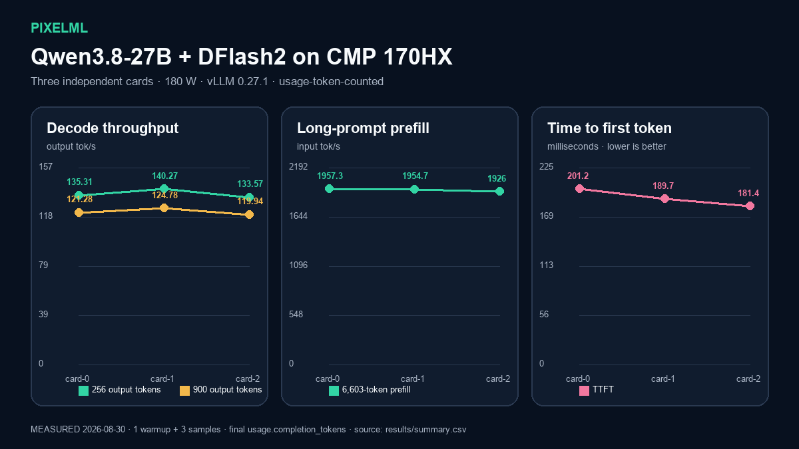

# Qwen3.8-27B W4A16 + DFlash2 on CMP 170HX

**Measured:** one CMP 170HX at a time, 180 W limit, vLLM 0.27.1, DFlash2 `k=7`, BF16 KV, 65,536-token context. The three-card mean was **136.38 decode tok/s** for 256-token generations and **1,946 input tok/s** for the 6.6K-token prefill case.

## Run it

1. Open [reproduce.ipynb](reproduce.ipynb) on an Ubuntu machine with one CMP 170HX and forced airflow.
2. Set `PIXELML_RUN_LIVE=1` and the local model/cache paths in the configuration cell.
3. Run all cells in order. The notebook stops before load if the GPU, storage, temperature, or configuration gate fails.
4. Edit `PROMPT` in the final section and run the last `curl` cell to see the model response.

The notebook carries a clean snapshot of the measured output and regenerates the chart from [results/summary.csv](results/summary.csv). The manifest pins the three sanitized, usage-accounted receipt files by SHA-256. Historical infrastructure artifacts are deliberately excluded from this publication boundary.

## Reproducibility boundary

The runtime source, direct serving dependencies, and public model artifacts are pinned in [recipe.json](recipe.json). The original measured run recorded the runtime pin but not immutable Hugging Face revisions for every derived artifact; the publication pins close that gap for future reruns. Treat performance within the documented card-to-card spread as reproduced, not bit-for-bit identity with the earlier download. The legacy performance receipts did not retain a human-readable completion; a live notebook run validates and displays response text plus its final usage object before benchmarking.
