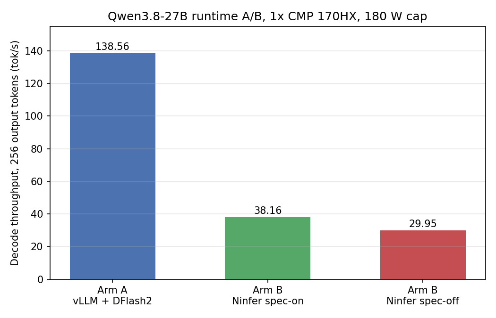

# Qwen3.8-27B runtime A/B: vLLM + DFlash2 vs. Ninfer sm_80 fork

Status: measured
Date: 2026-09-02
Hardware: 1x CMP 170HX, 180 W power cap

## Question

Does the `Ithrial/ninfer-cmp170hx` sm_80 fork of Ninfer, running Qwen3.8-27B
with its own MTP speculative decoding, beat the club's existing vLLM +
DFlash2 recipe on the same card. A prior attempt crashed at warmup
(`gqa_attention_prefill.cu:64: CUDA_CHECK ... invalid argument`) before any
number came back; this run checks whether that crash was fixed and, if so,
measures the result.

## Protocol

Streaming requests, temperature 0, `ignore_eos`, one warmup request plus
three timed samples per case. Cases: `decode256`, `decode900`, and
`prefill_long` (~6,654 prompt tokens). Tokens counted from the final SSE
usage object, not summed from stream events. Peak power, clock, and
temperature sampled from `nvidia-smi` during each run.

- **Arm A (control):** vLLM 0.27.1 + DFlash2, `k=7`, the club's existing
  Qwen3.8-27B recipe (see
  [docs/models/qwen3.8-27b.md](../../docs/models/qwen3.8-27b.md)).
- **Arm B (spec-on):** `Ithrial/ninfer-cmp170hx` (sm_80 fork), `--spec mtp
  --draft-tokens 3 --lm-head-draft --kv-dtype int8 --max-context 65536`.
- **Arm B (spec-off):** same fork and flags, without `--spec mtp
  --draft-tokens 3 --lm-head-draft`.

Both Arm B configurations booted and served cleanly on this attempt, and
`/health` returned `{"status":"ok"}` before benchmarking started. The prior
crash did not recur.

## Results

| Metric | Arm A (vLLM + DFlash2) | Arm B spec-on (MTP) | Arm B spec-off |
|---|---:|---:|---:|
| decode256 | 138.6 tok/s | 38.16 tok/s | 29.95 tok/s |
| decode900 | 123.4 tok/s | 39.15 tok/s | 29.55 tok/s |
| Mean TTFT, decode runs | 189.7 ms | 2.1 ms | 1.7 ms |
| TTFT, prefill_long (~6.6K prompt) | n/a | 22.5 ms | 36.7 ms |
| Peak power | 190.5 W | 195.9 W | 203.0 W |
| Peak SM clock | 1470 MHz (sampled); cap enforced at 1170-1200 MHz sustained | 1455 MHz | 1455 MHz |
| Peak core temp | 59 C | 67 C | 69 C |
| Peak VRAM | 58.6 GiB | 19.6 GiB | 18.7 GiB |

Arm A's low TTFT on `prefill_long` is not captured in this receipt set — the
benchmark script did not run that case against Arm A on this pass; treat it
as untested rather than as a zero.

## Verdict

**Stay on vLLM + DFlash2.** The Ninfer sm_80 fork is not competitive on this
card: spec-on decode is 3.6x slower than the control (38.16 vs. 138.6 tok/s),
and spec-off is 4.6x slower (29.95 vs. 138.6 tok/s).

MTP speculation gives a real, if modest, ~1.28x uplift over spec-off
(38.16/29.95 on decode256, 39.15/29.55 on decode900) — the draft path is
functioning and accepting tokens. The gap to vLLM is in the base per-pass
throughput of this engine build, not a spec-acceptance problem.

**Power note.** Ninfer's peak power draw (195.9-203.0 W) reads above the
180 W cap configured for the card, at a higher SM clock (1455 MHz) than Arm
A's control run (1170-1200 MHz sustained). This looks like a cap-enforcement
difference between the two engines' interaction with the driver's power
limit rather than a throughput finding, and is flagged here as a follow-up
question, not folded into the speed verdict above.

## Bandwidth-ceiling estimate

Using the spec-off run as the clean single-token-per-pass baseline (no
multi-token amortization): roughly 29.75 tok/s average across decode256 and
decode900, times about 15.92 GiB of weights, implies roughly 508.6 GB/s —
about 34% of a 1.5 TB/s HBM ceiling. This is the only bandwidth-utilization
number in this result that means what it looks like it means.

The same naive formula does not apply to the spec-on row or to Arm A: both
amortize one weight read across multiple accepted tokens per verification
pass, which pushes the naive ratio past 100% (Arm A comes out near 149%) and
makes the number meaningless without an accept-rate-normalized model. Arm A
has no captured non-speculative baseline in this receipt set, so its true
per-pass bandwidth utilization cannot be isolated the same way — this is a
gap in the evidence, not a claim.

## Harness note

The benchmark script's `nvidia-smi` peak sampler queried all four physical
GPUs with no `-i` flag on this four-card box, so its comma-split parsing
silently failed on every sample (caught by a bare `except`), producing an
all-zero peak reading on the first spec-on pass. Fixed by adding a GPU-index
environment variable passed to `nvidia-smi -i`, then rerunning spec-on to
collect the real peak numbers in the table above. Decode and TTFT figures
were unaffected on the first pass; only `gpu_peak` was wrong.

## Evidence

- `receipts/summary.json` — hand-verified summary of every number in the
  table above, plus the verdict and bandwidth-ceiling notes in full.
- `receipts/armA/bench.json` — per-sample and summary rows, Arm A control.
- `receipts/armA/metadata.txt` — package versions and run identity, Arm A.
- `receipts/armB/bench-spec-on.json` — per-sample and summary rows, Arm B spec-on.
- `receipts/armB/bench-nospec.json` — per-sample and summary rows, Arm B spec-off.
- Full server logs, raw `nvidia-smi` dumps, and telemetry time series stay
  on the host under the benchmark run's own directory; the files above are
  the sanitized summary.
