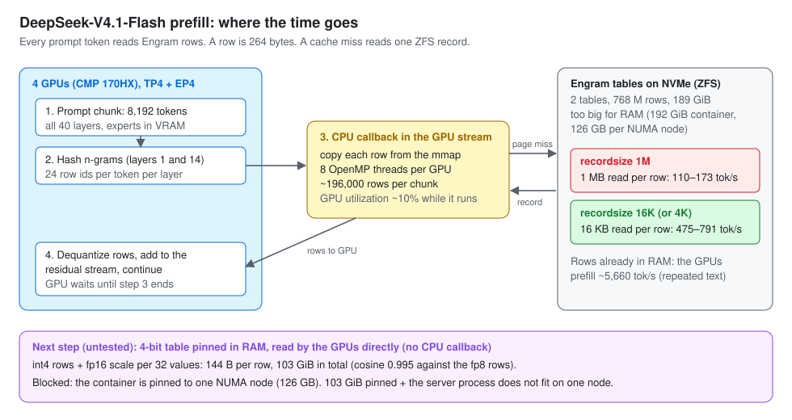
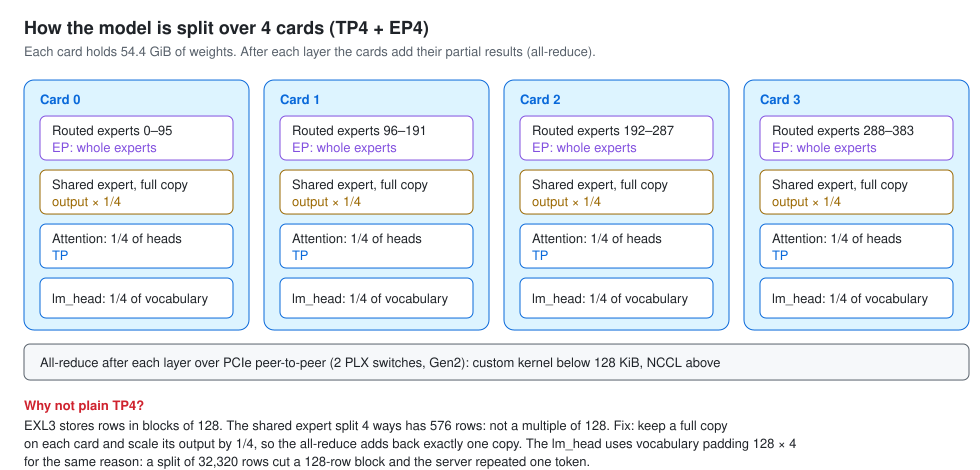
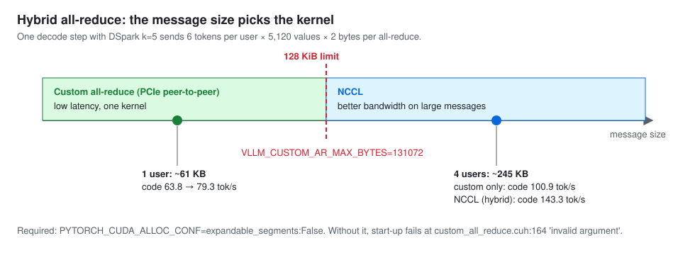
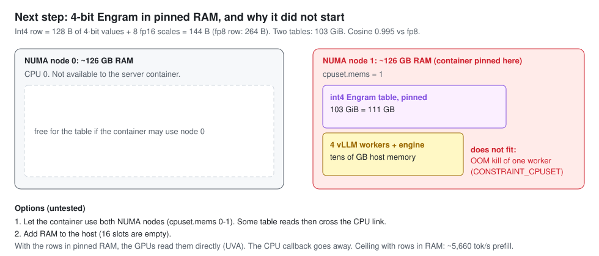

# DeepSeek-V4.1-Flash (EXL3 3.0 bpw): TP4 + EP4 on four cards, all routed experts in VRAM, DSpark

Status: measured
Date: 2026-10-03 to 2026-10-04

This result serves DeepSeek-V4.1-Flash from the [Mia-AiLab EXL3 3.0 bpw checkpoint](https://huggingface.co/Mia-AiLab/DeepSeek-V4.1-Flash-EXL3-3.0bpw) on four CMP 170HX cards. It starts from [0xSero/dsv41-flash-offload](https://github.com/0xSero/dsv41-flash-offload), a recipe for one GPU with host-offloaded experts. Five source changes make it run with tensor parallelism 4 (TP4) and expert parallelism 4 (EP4). All 384 routed experts stay in VRAM: each card holds 96 whole experts.

**Verdict (measured):** the served configuration decodes 97.8 tok/s on structured text, 74.7 on code and 51.2 on prose for one user. Four users get 224.2 / 150.5 / 112.6 tok/s in total. Prefill is 981–1,262 tok/s. It uses a 4-bit copy of the Engram n-gram tables pinned in host RAM (103 GiB). Five greedy known-answer prompts pass, but greedy output matches the fp8 tables on only 4 of 12 test prompts (fp8 against itself: 10 of 12). With the fp8 tables read from disk (v2), prefill is 475–791 tok/s and prose 26–38 tok/s.

Notebook: [`notebooks/2026-10-03-deepseek-v4.1-flash-exl3-4card-tp4ep4-dspark-vllm.ipynb`](../../notebooks/2026-10-03-deepseek-v4.1-flash-exl3-4card-tp4ep4-dspark-vllm.ipynb)





## Hardware

- Cards: 4 × CMP 170HX, 65,536 MiB each (64 GiB unlock), PCIe Gen2 behind two PLX switches. Three cards ran at x16 and one at x8.
- Power limit: 140 W per card (`nvidia-smi -pl 140`).
- Cooling: forced air. Peak core temperature was 70 °C in the runs with telemetry.
- Peer-to-peer: BAR1 peer-to-peer from the driver patches below. vLLM custom all-reduce uses it below 128 KiB.

## Software

- Host: Proxmox VE 9.2, kernel 7.0.2-6-pve. The server runs in a privileged LXC container that shares the host driver (GPUs passed with CDI). The int4 run lets the container use both NUMA nodes (251 GB RAM in total; container limit 192 GiB). The earlier runs used one node.
- NVIDIA driver: 615.71.09 open kernel modules with [PixelML/cmpunlocker](https://github.com/PixelML/cmpunlocker) tag `cmp170hx-plx-p2p-2026-10-02` (commit `6ca4da72f078553d37089ee741cd128aa7804504`).
- Served image (v3): `ghcr.io/pixelml/club-170hx@sha256:b8b7a1699bf272855a9b8c8b316f796b3ef917696302baf2a62c856707d69932`, built by [`build/Dockerfile`](build/Dockerfile).
- v2 image (fp8 Engram from disk only): `ghcr.io/pixelml/club-170hx@sha256:0be9dfdf9fb83a04029108a410236563a9463accd91af010324498ab5f401f5c`.
- First image (no custom all-reduce patch): `ghcr.io/pixelml/club-170hx@sha256:ffba0e15b5295204a3860fae7ba93fd70fe94d824f79baa1340ab71fa1f451f8`.
- Base image: `ghcr.io/pixelml/club-170hx@sha256:75683c4813efaabcc1a96ee610a96a74336677c4a8776b79b01abd83ff3c0c7b`, built from `0xSero/dsv41-flash-offload` @ `2e9da5ecdab37c232c2da887e25c33a99da738d3` with `docker build --build-arg TORCH_CUDA_ARCH_LIST=8.0 -f docker/Dockerfile .` Its Dockerfile pins `lazymio/vllm-backport@sha256:349690323ab9aba712111529ed1ca60730199205d8202f67895ffde85b451be3` (vLLM 0.13 backport with DeepSeek-V4.1), Tokha233 a100-turbo `fae324ae62ac5cef31b7d38f5d369618e1cae1fa`, exllamav3 `5be886578ec80324c2c715269387be2058724b6e` and vllm-exl3 `d3cfd394920360d69f820d2dc96f8292a9e10283`.
- Our changes are in [`build/`](build/). The diffs are in [`build/patches/`](build/patches/):
  - `exl3.patch` (vllm-exl3, AGPL-3.0): do not split `ReplicatedLinear` weights; read the MoE split from the layer's MoE parallel config, so EP keeps whole experts; load each card's lm_head rows from vLLM's shard range.
  - `v4model.patch`: `DSV41_REPLICATE_SHARED=1` replicates the shared expert (2304 / 4 = 576 rows is not a multiple of 128) and scales its output by 1/4 before the MoE all-reduce.
  - `v41model.patch`: build the EXL3 lm_head with vocabulary padding 128 × tp, so each card's slice starts on a 128-row Hadamard block.
  - `engram_disk.patch` (MIT): let the disk Engram tier run at TP > 1. Every card reads all heads from the shared mmap. `DSV41_ENGRAM_SINGLE=1` (card 0 reads, NCCL copies) is included but off: it did not help.
  - `custom_all_reduce.patch` (vLLM, Apache-2.0): `VLLM_FORCE_CUSTOM_AR_PCIE=1` allows the custom all-reduce on more than two PCIe GPUs with working peer-to-peer. `VLLM_CUSTOM_AR_MAX_BYTES` sets the size limit.
  - `engram.patch` (vLLM backport, Apache-2.0): `DSV41_ENGRAM_INT4=1` reads int4 Engram rows (offset-binary, value = (q − 8) × scale, fp16 scale per 32 values, 144 B per row) from the pinned host table with a Triton kernel.
  - [`build/engram_int4.py`](build/engram_int4.py) (also `/opt/dsv41/engram_int4.py` in the image): converts the two fp8 Engram shards to int4 shards with the same tensor names. CPU only.
- Checkpoint: [`Mia-AiLab/DeepSeek-V4.1-Flash-EXL3-3.0bpw`](https://huggingface.co/Mia-AiLab/DeepSeek-V4.1-Flash-EXL3-3.0bpw) @ `c5534b90602b4090980a1c3ded1eb3b4d99a38d5` (MIT; routed experts EXL3 3 bpw, head 6 bpw, MTP 4 bpw).
- Engram tables: [`deepseek-ai/DeepSeek-V4.1-Flash`](https://huggingface.co/deepseek-ai/DeepSeek-V4.1-Flash) @ `2cba9e42aa026125f3ed06c6d98c1db82f7ca027`, shards 47 and 48 (MIT), converted to int4 with `engram_int4.py` (served), or copied with `dd` to a ZFS dataset with `recordsize=16K` (v2).
- Drafter: DSpark over the checkpoint's `mtp.0`–`mtp.2` layers, `num_speculative_tokens` 5.

## Command

```bash
hf download Mia-AiLab/DeepSeek-V4.1-Flash-EXL3-3.0bpw --revision c5534b90602b4090980a1c3ded1eb3b4d99a38d5 \
  --local-dir /path/to/models/Mia-DeepSeek-V4.1-Flash-EXL3-3.0bpw
hf download deepseek-ai/DeepSeek-V4.1-Flash --revision 2cba9e42aa026125f3ed06c6d98c1db82f7ca027 \
  --include "model-00047-of-00048.safetensors" "model-00048-of-00048.safetensors" "config.json" \
  "model.safetensors.index.json" "inference/engram.py" --local-dir /path/to/models/DeepSeek-V4.1-Flash-engram
# Int4 Engram tables (served). Needs about 111 GB of free RAM that the server can pin
# (on a multi-socket host: allow every NUMA node). CPU only.
mkdir -p /path/to/models/engram-int4
for s in 47 48; do
  docker run --rm --entrypoint python3 -v /path/to/models:/models ghcr.io/pixelml/club-170hx@sha256:b8b7a1699bf272855a9b8c8b316f796b3ef917696302baf2a62c856707d69932 /opt/dsv41/engram_int4.py \
    /models/DeepSeek-V4.1-Flash-engram/model-000$s-of-00048.safetensors \
    /models/engram-int4/model-000$s-of-00048.safetensors --workers 16
done
docker run --rm --gpus '"device=0"' -v /path/to/models:/models \
  ghcr.io/pixelml/club-170hx@sha256:75683c4813efaabcc1a96ee610a96a74336677c4a8776b79b01abd83ff3c0c7b prepare
docker run -d --name dsv41 --gpus all --ulimit memlock=-1 --shm-size 16g -p 8040:8040 \
  -e DSV41_ENGRAM_DISK=0 -e DSV41_ENGRAM_INT4=1 \
  -v /path/to/models:/models:ro \
  -v /path/to/models/engram-int4/model-00047-of-00048.safetensors:/models/DeepSeek-V4.1-Flash-engram/model-00047-of-00048.safetensors:ro \
  -v /path/to/models/engram-int4/model-00048-of-00048.safetensors:/models/DeepSeek-V4.1-Flash-engram/model-00048-of-00048.safetensors:ro \
  ghcr.io/pixelml/club-170hx@sha256:b8b7a1699bf272855a9b8c8b316f796b3ef917696302baf2a62c856707d69932 \
  --speculative-config '{"method":"dspark","num_speculative_tokens":5}'
# Alternative (v2, exact fp8 output): fp8 tables read from disk. On ZFS, copy them with dd to a dataset with
# recordsize=16K (cp can clone blocks, and clones keep the 1M record size), mount those two files instead,
# and leave out the two -e flags.
zfs create -o recordsize=16K -o compression=off -o atime=off <pool>/engram16k
for s in 47 48; do
  dd if=/path/to/models/DeepSeek-V4.1-Flash-engram/model-000$s-of-00048.safetensors \
     of=/<pool>/engram16k/model-000$s-of-00048.safetensors bs=16M status=progress
done
```

[`build/launch.sh`](build/launch.sh) holds every serve argument. The image sets `CUSTOM_AR=1 VLLM_FORCE_CUSTOM_AR_PCIE=1 VLLM_CUSTOM_AR_MAX_BYTES=131072 PYTORCH_CUDA_ALLOC_CONF=expandable_segments:False`. Set `CUSTOM_AR=0` on a host without GPU peer-to-peer.

## Results (measured)

Decode: T=0, 400 tokens, median of 3, through the OpenAI API. Generated tokens come from the final usage object. One server boot per row. Engram storage: 1M, 16K or 4K is the ZFS `recordsize` of the fp8 Engram tables on disk; int4 in RAM is the 4-bit table pinned in host RAM. AR is the all-reduce mode.

| configuration | 1 user struct / code / prose (tok/s) | 4 users aggregate struct / code / prose (tok/s) | prefill 7k–51k (tok/s) |
|---|---|---|---|
| no drafter, 1M, NCCL | 25.4 / 25.4 / 12.1 | 78.3 / 73.0 / 40.7 | 110–173 |
| DSpark k=5, 1M, NCCL | 99.5 / 48.9 / 10.0 | 214.1 / 128.2 / 49.0 | – |
| DSpark k=10, 1M (half cached), NCCL | 55.5 / 53.3 / 24.7 | 45.0 / 40.3 / 23.3 | 193–360 |
| DSpark k=5, 16K, NCCL | 100.6 / 63.8 / 30.3 | 219.3 / 142.6 / 97.2 | – |
| DSpark k=5, 16K, custom AR | 98.6 / 75.6 / 35.3 | 171.3 / 100.9 / 74.5 | 475–791 |
| DSpark k=5, 16K, hybrid AR (v2) | 98.4 / 79.3 / 26.2 | 220.9 / 143.3 / 85.0 | (same storage as above) |
| DSpark k=5, 4K, hybrid AR | 98.5 / 75.4 / 37.5 | – | 446–775 |
| **DSpark k=5, int4 in RAM, hybrid AR (served)** | **97.8 / 74.7 / 51.2** | **224.2 / 150.5 / 112.6** | **981–1,262** |

- Prose changes from boot to boot by up to ±20%. Its speed depends on which Engram rows are in the page cache.
- Known-answer checks: 5 / 5 with DSpark k=5 on 1M ([`receipts/correctness.json`](receipts/correctness.json)) on 16K ([`receipts/dspark-k5-16k-customar/correctness.json`](receipts/dspark-k5-16k-customar/correctness.json)) and with the int4 table ([`receipts/dspark-k5-int4-ram/correctness.json`](receipts/dspark-k5-int4-ram/correctness.json)).
- Edit reply: the same 4,720-token reply (sha256 prefix `b755ea88e04201c2`) with no drafter, k=5 and k=10.
- KV pool at 65,536 context, fp8: 570,145 tokens without a drafter, 263,972 with DSpark k=5.
- With the Engram rows already in RAM (repeated text), the GPUs prefill about 5,660 tok/s. This is a server log line. It is not in the receipts.



## What did not help (measured)

- TP4 without EP: EXL3 refuses the 576-row shared-expert slice.
- TP2 × PP2: the stage-1 KV allocation refers to compressor caches of stage-0 layers 2, 8 and 14.
- An lm_head split of 32,320 rows per card: the server repeats one token. The bad ids are at local row 32,256 of each card.
- DSpark k=7: rejected. `num_speculative_tokens` must be a multiple of `n_predict` = 5.
- One-rank Engram lookup: correct, but prefill stays at 107–173 tok/s.
- 4K records instead of 16K: the same speed.
- Custom all-reduce without a size limit: −22% to −29% for four users.

## Int4 Engram in pinned RAM (measured, served)



- Int4 rows with an fp16 scale for each 32 values use 144 bytes per row, 103 GiB for both tables (cosine 0.995 against the fp8 rows on 4,096 rows). Each card pins its quarter of each table (12.87 GiB per layer) and reads the rows over PCIe. There is no CPU callback and no disk read.
- The first start-up failed when the container could use only one NUMA node (126 GB): an out-of-memory kill of one worker. With both nodes allowed, the container used 115 GB after start-up.
- Quality ([`receipts/dspark-k5-int4-ram/logprob-compare.txt`](receipts/dspark-k5-int4-ram/logprob-compare.txt), scripts [`qref.py`](qref.py), [`qcmp.py`](qcmp.py)): 12 prompts, greedy, 64 tokens. Int4 against fp8: 4 of 12 completions identical, mean |Δ logprob| 0.0498. Fp8 against fp8 (two boots): 10 of 12, 0.0044. The 5 known-answer checks pass. The int4 table changes the wording more than run-to-run noise does. A task benchmark was not run (untested).
- Use the fp8 disk tier (the image default, `DSV41_ENGRAM_DISK=1`) when output must match the reference model.

## Receipts

- `receipts/<configuration>/decode-*.json|stdout`: decode results, one file for each prompt type and number of users.
- `receipts/<configuration>/prefill.json|out`, `receipts/no-drafter/longdecode.json`.
- `receipts/<configuration>/edit.json|out`: edit-reply bench, including the reply text.
- `receipts/<configuration>/spec-metrics.txt`: vLLM speculative-decoding counters.
- `receipts/{no-drafter,dspark-k5,dspark-k10}/telemetry.csv`: 2 s `nvidia-smi` samples (the later runs did not record telemetry).
- Folder names: `dspark-k5-int4-ram` is the served configuration (`qref-*.json`: logprob references). `dspark-k5-16k-hybrid` is v2. `1m`, `16k` and `4k` are the Engram record sizes. `customar`, `nccl` and `hybrid` are the all-reduce modes.
- Bench scripts: [`bench_decode.py`](bench_decode.py), [`bench_edit.py`](bench_edit.py), [`bench_long.py`](bench_long.py). Quality scripts: [`correct.py`](correct.py), [`qref.py`](qref.py), [`qcmp.py`](qcmp.py).
