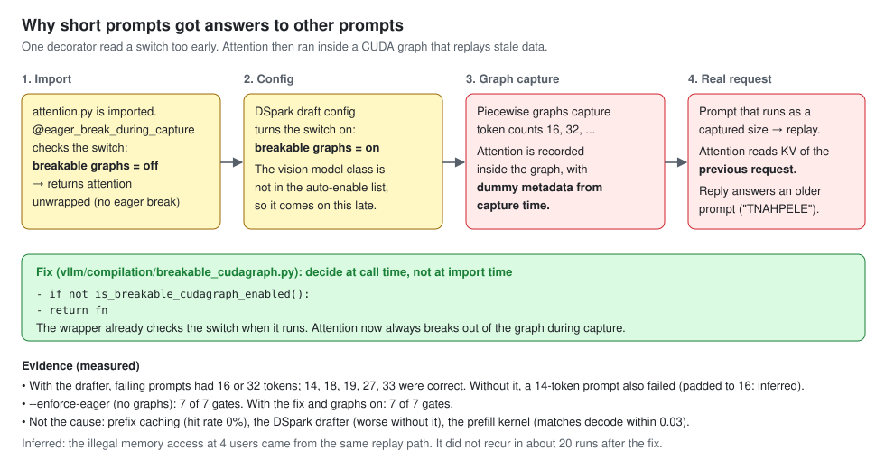

# DeepSeek-V4-Flash-Vision-Exp: TP4 on 4× CMP 170HX, P2P, a CUDA-graph fix, and an autoresearch loop

Status: measured
Date: 2026-10-03 to 2026-10-04

**Verdict (measured):** with a two-line fix in vLLM's CUDA-graph code, DeepSeek-V4-Flash-Vision-Exp gives correct output on four CMP 170HX cards with tensor parallelism 4: 7 of 7 quality gates, 82–132 tok/s for one user, 192–266 tok/s for four users, about 1,300 tok/s prefill. Before the fix, short prompts got answers that belonged to other prompts. GLM-5.3-Flash on the same cards does 396–418 tok/s for one user.

Notebook: [`notebooks/2026-10-04-deepseek-v4-flash-vision-exp-4card-tp4-autoresearch-vllm.ipynb`](../../notebooks/2026-10-04-deepseek-v4-flash-vision-exp-4card-tp4-autoresearch-vllm.ipynb)

## Pins

- Served image: `ghcr.io/pixelml/club-170hx@sha256:97ecb29396abc87a9a4f99e18e561f97dc610ca1d79788819d374f5fff1205ba`, built by [`build/Dockerfile`](build/Dockerfile) on the base image below. Diffs: [`build/patches/`](build/patches/).
- Base image: `ghcr.io/pixelml/club-170hx@sha256:b26232f8f041c988d3285e2278c9f5001cc49f96131bb0b22a9d38b5e5e061cd` (2026-09-02 vision image: allover326 SM80 fork `f8ea5bb163c161ef38b401d055cc5fd4a934091a` + SM80/DSpark patch set + vision port; see [PixelML/DeepSeek-V4-Flash-Vision-Exp-CMP-170HX](https://github.com/PixelML/DeepSeek-V4-Flash-Vision-Exp-CMP-170HX)).
- Model: [`deepseek-ai/DeepSeek-V4-Flash-Vision-Exp`](https://huggingface.co/deepseek-ai/DeepSeek-V4-Flash-Vision-Exp) @ `86f746b36186f0e567729a5c06a8c918caba82a9` (MIT).
- Driver: NVIDIA 615.71.09 open with [PixelML/cmpunlocker](https://github.com/PixelML/cmpunlocker) tag `cmp170hx-plx-p2p-2026-10-02` (`6ca4da72f078553d37089ee741cd128aa7804504`). Host: Proxmox VE 9.2, kernel 7.0.2-6-pve, privileged LXC, 140 W per card, PCIe Gen2 (three x16, one x8).
- P2P check: [Morrowmake/glm53-flash-cmp170hx-recipe](https://github.com/Morrowmake/glm53-flash-cmp170hx-recipe) `p2p_probe.cu` @ `e61ba680cd6f9497291cafa4ca13ac3ffbdab844` (v1.7.0).

## Changes in the served image

1. `breakable_cudagraph.py`: `@eager_break_during_capture` decides at call time. At import time the breakable-graph switch was still off, so DeepSeek-V4 attention was captured into CUDA graphs with dummy metadata and replayed stale KV.
2. `rocm_aiter_mla_sparse.py`: split-K sparse-MLA decode kernels on CUDA sm_80 (attention decode 56 → 39.5 µs).
3. `speculative.py`: no MTP `n_predict` divisibility check for DSpark (lets k=5 and k=7 start; k=6 is served).
4. `custom_all_reduce.py`: `VLLM_FORCE_CUSTOM_AR_PCIE=1` allows the custom all-reduce on PCIe P2P. The served config turns it off (`--disable-custom-all-reduce`): NCCL is faster here.

## Command

See section 7 of the notebook. Serve args: `--tensor-parallel-size 4 --kv-cache-dtype fp8 --block-size 256 --max-model-len 16384 --max-num-batched-tokens 2048 --gpu-memory-utilization 0.90 --max-num-seqs 8 --disable-custom-all-reduce --compilation-config '{"cudagraph_mode":"FULL_DECODE_ONLY"}' --speculative-config '{"method":"dspark","num_speculative_tokens":6}'`, env `NCCL_P2P_LEVEL=SYS PYTORCH_CUDA_ALLOC_CONF=expandable_segments:False`.

## Results (measured)

| layout (before the fix, base image) | prefill | c1 | c4 total | c8 total | image c1 | probes on topic |
|---|---:|---:|---:|---:|---:|---:|
| TP4, P2P on | 1,292 | 168 | 297 | 258 | 44 | 3/5 |
| TP4, P2P off | 1,516 | 164 | crash | – | – | 3/5 |
| TP4 + EP4, P2P on | 1,349 | 160 | crash | – | – | 3/5 |
| TP4, P2P on, no drafter | 1,333 | 57 | 138 | 199 | 56 | 2/5 |
| PP4, P2P on | 2,348 | 159 | 202 | 236 | 46 | 3/5 |
| **TP4, fixed image (2 runs)** | **1,283 / 1,321** | **132 / 82** | **192 / 266** | – | gate pass | **5/5** |

- Single-user decode varies about ±40% between runs of the same build: greedy output is not identical from run to run, so draft acceptance changes.
- The autoresearch loop ran 27 experiments: 4 real wins, 12 discards, 5 crashes (`autoresearch/results.tsv`).

## Files

- `receipts/<layout>/`: gate, correctness, probe, vision, prefill, TTFT, text and image ladders, telemetry, serve config. `receipts/p2p-content-check.json`.
- `autoresearch/`: `program.md` (the loop's rules), `run_experiment.sh` (fixed harness), `results.tsv`, `NOTES.md`, `runs/<time>-<commit>/` (per-experiment receipts), `serve.args` and `serve.env` of the best commit.
- `build/`: Dockerfile, the 4 patched files, `patches/`, `run.sh` and `protocol.sh` (layout runs).
- Bench scripts: `autoresearch/bench_harness.py`, `correct.py`, `probe.py`, `vision_check.py`.
