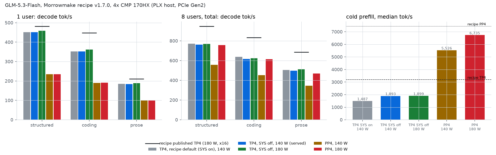

# GLM-5.3-Flash: Morrowmake recipe v1.7.0 on a 4-card PLX host, TP4 vs PP4, P2P and power

Status: measured
Date: 2026-10-04

**Verdict (measured):** the unmodified recipe v1.7.0 (one launcher line changed for CDI) serves GLM-5.3-Flash on 4× CMP 170HX with verified P2P. Served config, TP4, `GLM5_NCCL_P2P_SYS=0`, 140 W: 450.8 / 352.4 / 184.6 tok/s for one user (structured / code / prose), 762.4 / 616.9 / 498.5 tok/s for eight users, prefill 1,789–1,911 tok/s. `GLM5_NCCL_P2P_SYS=0` makes TP4 prefill 25–57% faster on this two-switch host. PP4 at 180 W prefills 6,359–7,151 tok/s.

Notebook: [`notebooks/2026-10-04-glm-5.3-flash-morrowmake-v1.7.0-4card-tp4-pp4-p2p-vllm.ipynb`](../../notebooks/2026-10-04-glm-5.3-flash-morrowmake-v1.7.0-4card-tp4-pp4-p2p-vllm.ipynb)

## Pins

- Engine image: `ghcr.io/morrowmake/vllm-cmp170hx@sha256:158627a705b6ae24fa63ba6eb454982454c5e6b94b1e32981faf33eb81a7ea3e` (Morrowmake/vllm-cmp170hx `c1ce6491efe53934119d306d0a0501b475458e9b`).
- Recipe: [Morrowmake/glm53-flash-cmp170hx-recipe](https://github.com/Morrowmake/glm53-flash-cmp170hx-recipe) `e61ba680cd6f9497291cafa4ca13ac3ffbdab844` (v1.7.0) + [`build/start.sh.patch`](build/start.sh.patch) (`--gpus all` → `--device nvidia.com/gpu=all`).
- Target: `canada-quant/GLM-5.3-Flash-W4A16-MTP` @ `5723f4d02af36366c23ace8668866ca7775855c1` (MIT; the weights are identical in `75ba0dbbc68f475f2538a789807843f5d1264220`). Drafter: `incoai/GLM-5.3-Flash-DFlash2` @ `bf582e4eacc1810f76656d1811693ff6c6737d2a` (CC BY-NC-ND 4.0).
- Driver: NVIDIA 615.71.09 open + [PixelML/cmpunlocker](https://github.com/PixelML/cmpunlocker) tag `cmp170hx-plx-p2p-2026-10-02` (`6ca4da72f078553d37089ee741cd128aa7804504`). Host: Proxmox VE 9.2, kernel 7.0.2-6-pve, privileged LXC, GPUs by CDI. Topology: two PLX switches (cards 0–1 PIX, 2–3 PIX, cross pairs PHB), PCIe Gen2, three x16 and one x8. HBM: 1,728 MHz on all four cards (170tune NDIV 64, applied at boot; nvidia-smi shows the stock 1,458 MHz on cards 1 and 2).
- Served `.env`: `LAYOUT=tp4 HOST=0.0.0.0 PORT=8030 P2P=auto GLM5_NCCL_P2P_SYS=0 MODELS_DIR=<models>`.

## Results (measured)

| configuration | 1u struct / code / prose | 8u struct / code / prose | prefill tok/s |
|---|---|---|---:|
| TP4, recipe default (SYS on), 140 W | 451.7 / 351.8 / 184.7 | 771.3 / 638.0 / 504.1 | 1,140–1,530 |
| **TP4, SYS off, 140 W (served)** | **450.8 / 352.4 / 184.6** | **762.4 / 616.9 / 498.5** | **1,789–1,911** |
| TP4, SYS off, 180 W | 458.5 / 361.7 / 189.1 | 769.0 / 624.0 / 511.5 | 1,787–1,916 |
| PP4, 140 W | 234.7 / 190.5 / 100.8 | 556.8 / 451.8 / 345.9 | 5,211–5,879 |
| PP4, 180 W | 235.4 / 191.0 / 101.0 | 756.2 / 614.7 / 468.0 | 6,359–7,151 |
| Recipe published TP4 / PP4 (180 W, x16) | 482.2 / 447.7 / 210.6 | 948.6 / 834.1 / 684.6 | 3,197 / 7,444 |

- The PP4 runs kept the recipe default `NCCL_P2P_LEVEL=SYS`. PP4 with SYS off is untested.
- Peak core temperature: 69–72 °C. A watchdog (`glm_chain.sh`) would have stopped the run at 80 °C.

## Files

- `receipts/<run>/`: decode JSON and stdout for each prompt type and number of users, `prefill.json`, `telemetry.csv`, `nvidia-smi-start.csv` (power cap), and `launch.txt` (layout, image and P2P lines from `start.sh`). The first run has no `nvidia-smi-start.csv`; it ran at the host default of 140 W.
- `bench_decode.py` (MiaAI-Lab protocol), `bench_long.py`, `bench_glm.sh`, `glm_chain.sh`.
